### 生物地理学数据的处理与可视化

# 生物地理学
生物地理学结合了GIS技术、遥感和生态学的知识，不学就亏了。
但以下内容都可以用ArcGIS和ENVI解决，因此也就图一乐。
原作：Jesús N. Pinto-Ledezma and Jeannine Cavender-Bares
- [生物地理学](#生物地理学)
  - [物种分布与生物多样性](#物种分布与生物多样性)
    - [数据的准备与地理可视化](#数据的准备与地理可视化)
    - [获得点数据的简单范围](#获得点数据的简单范围)
      - [基于最小凸多边形（Convex hull）](#基于最小凸多边形convex-hull)
      - [基于动态Alpha的边界](#基于动态alpha的边界)
    - [多样性的梯度（点数据的范围（不简单）](#多样性的梯度点数据的范围不简单)
      - [尺度依赖问题](#尺度依赖问题)
    - [物种分布模型？](#物种分布模型)
      - [空间自相关](#空间自相关)
  - [物种分布与生态位模型](#物种分布与生态位模型)
    - [生态位模型的拟合与预测](#生态位模型的拟合与预测)
      - [Bioclim模型](#bioclim模型)
      - [Gower模型](#gower模型)
      - [支持向量机SVM](#支持向量机svm)
      - [广义线性模型](#广义线性模型)
  - [运用光谱数据调查生物多样性](#运用光谱数据调查生物多样性)
    - [获取波段图谱](#获取波段图谱)
    - [基于遥感的生态指标](#基于遥感的生态指标)
  - [物种分布模型包:biomod2](#物种分布模型包biomod2)
    - [准备biomod2](#准备biomod2)
    - [单变量模型拟合与预测](#单变量模型拟合与预测)
    - [多变量模型拟合与预测](#多变量模型拟合与预测)
  - [物种迁徙模型:KissMig](#物种迁徙模型kissmig)
    - [KissMig功能与组成](#kissmig功能与组成)
      - [kissmig( )](#kissmig-)
      - [kissmigAccess( )](#kissmigaccess-)
    - [KissMig的使用](#kissmig的使用)
## 物种分布与生物多样性
在本实验中，你将学习R中的基本工具，以可视化物种分布，建立地理范围，以测试不同方法下生物多样性梯度的驱动力。
你将需要三个数据集，它们都在[我的github](https://github.com/Vendredii/Rstats)中：
   1.物种分布数据点-live.oaks.txt
   2.物种地理范围-Furnarii_ranges_geo.shp
   3.环境预测因子-bio1.bil和bio12.bil
### 数据的准备与地理可视化
首先是准备必要的包和地理分布数据。
```r
#加载相关的包
library(maptools)
library(rgdal)
library(raster)
library(sp)
library(rangeBuilder)
library(sf)
library(spdep)
library(ncf)
library(ape)
library(geiger)
library(dismo)
library(spatialreg)
#加载物种分布数据
oaks <- read.table("Data/live.oaks.txt", header = TRUE)
#看一下发现都是坐标
head(oaks)
#使用maptools包将点绘制在地图（这里是简单版世界地图）上
data(wrld_simpl)
{plot(oaks[c(2:3)], col = "blue", pch = 19)
plot(wrld_simpl, add = TRUE)}
```
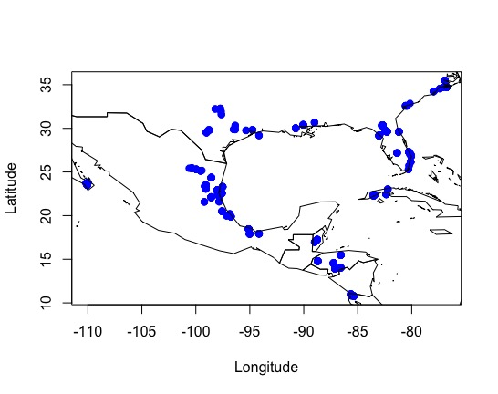
可以在图中显示其中的一个物种，如*Quercus virginiana*
```r
#提取物种列表
unique(oaks$Species)
#找到我们要的种
que_vir <- subset(oaks, oaks$Species == "Quercus_virginiana")
#绘图
{plot(que_vir$Longitude, que_vir$Latitude, pch = 15)
plot(wrld_simpl, add = TRUE)}
```
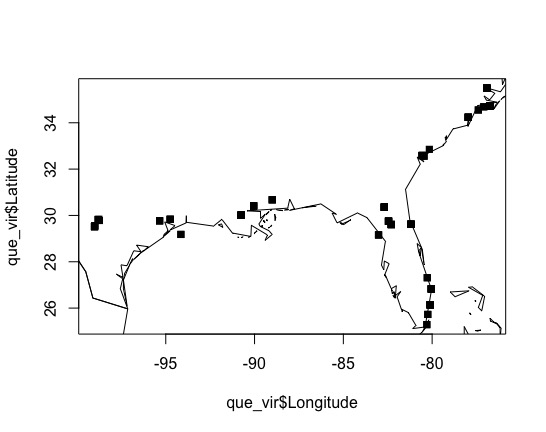
接下来我们可以检查是否有重复的点：
```r
oaks_dups <- duplicated(oaks[, c(2:3)])
length(which(oaks_dups == TRUE))
#看看有多少不重复的
length(which(oaks_dups == FALSE))
oaks_dups_row <- which(oaks_dups == TRUE)
length(oaks_dups_row)
#挑选出不重复的
oaks_nodups <- oaks[-oaks_dups_row,]
#查看数据纬度
dim(oaks_nodups)
head(oaks_nodups)
#不同颜色绘制看看区别
{plot(oaks$Longitude, oaks$Latitude, pch = 19, col = "red", cex = 2)
points(oaks_nodups$Longitude, oaks_nodups$Latitude, pch = 16, col = "black")}
```
### 获得点数据的简单范围
该部分可用于基于几何形状（例如最小凸多边形等）创建“简单”范围图，而无需考虑环境变量（不包括ENM或SDM）。
#### 基于最小凸多边形（Convex hull）
```r
#在物种的记录周围创建一个多边形
oaks_hull <- convHull(oaks_nodups[, c(2:3)])
#把这个多边形画出来
{plot(oaks_hull)
points(oaks_nodups$Longitude, oaks_nodups$Latitude, pch = 16, col = "black")}
```
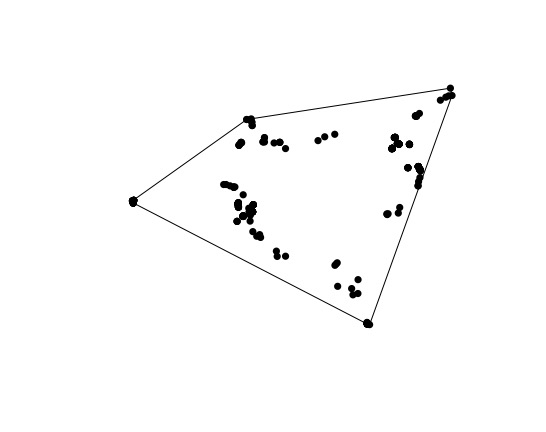
```r
#只对一个种绘制简单边界
que_vir <- subset(oaks_nodups, oaks_nodups$Species == "Quercus_virginiana")
que_vir_hull <- convHull(que_vir[, c(2:3)])
{plot(que_vir_hull)
points(que_vir$Longitude, que_vir$Latitude, pch = 16, col = "black")}
```
最后可以画一个综合大图
```r
#把所有树的点用黑色画出来
{plot(oaks_hull)
points(oaks_nodups$Longitude, oaks_nodups$Latitude, pch = 16, col = "black")
#把Quecus virginiana的分布用红色标出
plot(que_vir_hull, add = TRUE)
points(que_vir$Longitude, que_vir$Latitude, pch = 16, col = "red")
#加入世界地图
plot(wrld_simpl, add = TRUE)}
#注意，上面是套娃式的一整句语句
```
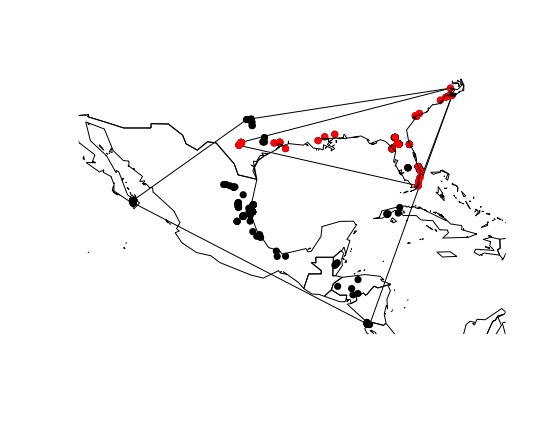
但明眼人都看得出来这样绘制物种范围显然太弱智了。
#### 基于动态Alpha的边界
好的，使用简单的凸包似乎不是活橡树的好工具，现在让我们尝试另一种方法。现在，我们将使用软件包rangeBuilder中的动态alpha包。
```r
#先画一个普通的，和上面没区别的
que_vir_alphahull <- getDynamicAlphaHull(que_vir, fraction = 0.95, coordHeaders = c("Longitude", "Latitude"),clipToCoast = 'no')[[1]]
#再来个动态Alpha的
{plot(que_vir_alphahull, lwd = 2, col = "red") 
plot(que_vir_hull, add = TRUE, lwd = 2, lty = 2)
points(que_vir$Longitude, que_vir$Latitude, pch = 16, col = "green")
plot(wrld_simpl, add = TRUE, lwd = 2)}
```
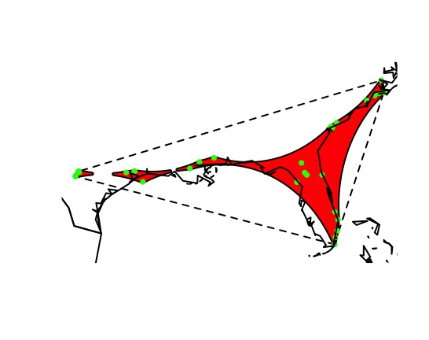
好像还是很扯淡。
### 多样性的梯度（点数据的范围（不简单）
在此之前，我们探讨了如何使用事件来绘制，清理和建立物种地理范围。 现在将使用最大的大陆性区域性辐射值(?)（Furnariides）结合物种地理范围来探索物种多样性的地理梯度。
我们使用的地理范围数据是*Infraorder Furnariides*（鸟类雀形目火炉亚目下的某个）。该数据可通过[BirdLife International](http://datazone.birdlife.org/species/requestdis)获得。当然可以使用IUCN或BIEN上的任何其他组。无论如何，你首先需要以shapefile格式下载它们的多边形。
要加载这些地理分布需要用到R包maptools的函数readShapePoly。我们可以通过设置方块（栅格）然后切出每块区域的物种丰富度。
**备注：以下操作均可在ArcGIS上完成**
```r
franges <- readShapePoly("Data/Franges/Furnarii_ranges_geo.shp")
str(franges)
#通过@来访问这些数据
head(franges@data)
#首先在1º纬度的空间分辨率下，使用这个鸟类的范围，在新热带区域创建一个空栅格。
neo_ras <- raster()
#extent函数可以确定空间范围
extent(neo_ras) <- extent(franges)
res(neo_ras) <- 1
neo_ras
values(neo_ras) <- 0
#使用空栅格，我们将对每个像元或像素中的物种标识进行“栅格化”。最终的栅格将是新热带地区这种鸟类的物种丰富度。
f_sr_raster <- rasterize(franges, neo_ras, field = "SCINAME", 
                         fun = function(x,...){length(unique(na.omit(x)))})
#在地图上显示
{plot(f_sr_raster)
plot(wrld_simpl, add = T)}
```
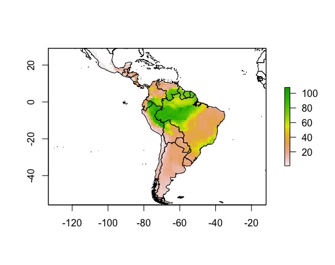
```r
#换颜色
colfuncYellows <- colorRampPalette(c("#d7191c", "#fdae61", "#ffffbf", "#abd9e9", "#2c7bb6"))
{plot(f_sr_raster, col = rev(colfuncYellows(100)), axes = FALSE, box = FALSE, 
     zlim = c(minValue(f_sr_raster), maxValue(f_sr_raster)), 
     xlab = "Furnariides richness", legend.width = 2)
plot(wrld_simpl, add = T)}
```
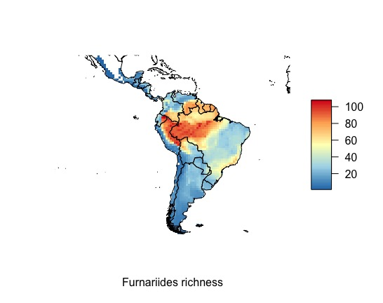
让我们尝试栅格化来自shp数据集的其他信息。我们将使用“RD”列中的信息，此数据对应于从尖端到系统树根部的节点数或**根距(RD)**（系统发育分支间的距离？），因此，将使用RD计算**平均根距离(MRD)**，用于衡量一个群落中物种的进化衍生性(Kerr＆Currie, 1999)，也可用于确定本地动物群主要是由早生物种还是近来起源的物种组成(Hawkins et al, 2012)。
```r
head(franges@data)
f_MRD_raster <- rasterize(franges, neo_ras, field = "RD", fun = mean)
{plot(f_MRD_raster)
plot(wrld_simpl, add = T)}
#换颜色加标题
{plot(f_MRD_raster, col = rev(colfuncYellows(100)), axes = FALSE, box = FALSE, 
     zlim = c(minValue(f_MRD_raster), maxValue(f_MRD_raster)), 
     xlab = "Furnariides mean root distance", legend.width = 2)
plot(wrld_simpl, add = T)}
```
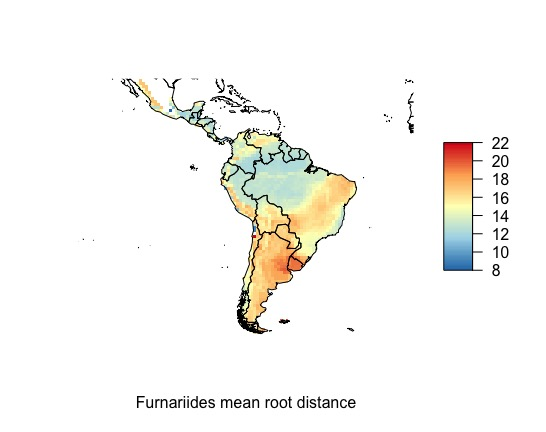
```r
#把两张图合并
{par(mfrow = c(1, 2))
plot(f_sr_raster, col = rev(colfuncYellows(100)), axes = FALSE, box = FALSE, 
     zlim = c(minValue(f_sr_raster), maxValue(f_sr_raster)), 
     xlab = "Furnariides richness", legend.width = 2)

plot(f_MRD_raster, col = rev(colfuncYellows(100)), axes = FALSE, box = FALSE, 
     zlim = c(minValue(f_MRD_raster), maxValue(f_MRD_raster)), 
     xlab = "Furnariides mean root distance", legend.width = 2)}
```
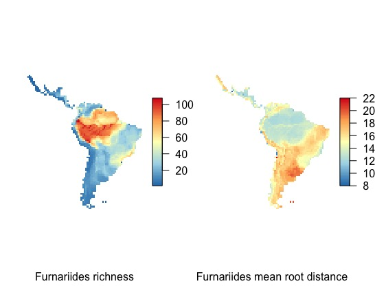
#### 尺度依赖问题
现在，我们将探讨生态和进化中最古老的问题之一，即数据中的“尺度依赖性”。 因此，要探索这种尺度相关性，我们将对*Furnariides*属的范围进行栅格化，但要使用从2到4度的纬度的不同空间分辨率。
```r
#设置2°和4°的格网
#2º
neo_ras_2dg <- raster()
extent(neo_ras_2dg) <- extent(franges)
res(neo_ras_2dg) <- 2
neo_ras_2dg
values(neo_ras_2dg) <- 0
#4º
neo_ras_4dg <- raster()
extent(neo_ras_4dg) <- extent(franges)
res(neo_ras_4dg) <- 4
neo_ras_4dg
values(neo_ras_4dg) <- 0
#分别套数据得到不同大小尺度的物种多样性
f_sr_2dg_raster <- rasterize(franges, neo_ras_2dg, field = "SCINAME", fun = function(x,...){length(unique(na.omit(x)))})
f_sr_4dg_raster <- rasterize(franges, neo_ras_4dg, field = "SCINAME", fun = function(x,...){length(unique(na.omit(x)))})
#画在一个图里
{par(mfrow = c (1, 3))
plot(f_sr_raster, main = "Furnariides richness 1dg")
plot(wrld_simpl, add = T)

plot(f_sr_2dg_raster, main = "Furnariides richness 2dg")
plot(wrld_simpl, add = T)

plot(f_sr_4dg_raster, main = "Furnariides richness 4dg")
plot(wrld_simpl, add = T)}
```
看看有什么区别呢？
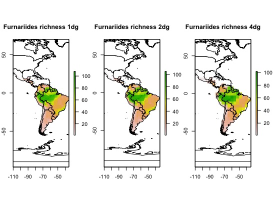
### 物种分布模型？
加载与bio1（年平均温度）和bio12（年降水量）相对应的环境变量。这些数据对应于[WorldClim](http://www.worldclim.org/current)中19个变量中的两个。我们将仅出于教育目的使用这两个变量，而不是对物种与环境的关系进行完整的评估。
```r
#加载并绘制2个气候因子
bio1 <- raster("Data/Envi/bio1.bil")
bio1
bio12 <- raster("Data/Envi/bio12.bil")
bio12
#显示一下这是全球的气候数据
{par(mfrow = c(2, 1))
plot(bio1)
plot(bio12)}
#按这个属的鸟类的分布区域进行裁剪
bio1_neo <- crop(bio1, extent(franges))
bio12_neo <- crop(bio12, extent(franges))
#绘制
{par(mfrow = c(1, 2))
plot(bio1_neo, main = "Annual Mean Temperature")
plot(bio12_neo, main = "Annual Precipitation")}
```
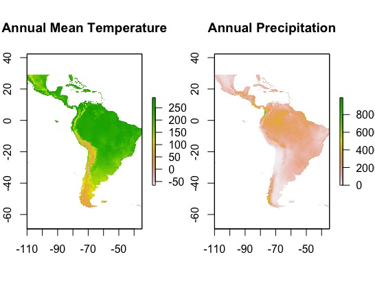
现在，我们将从*Furnariides*属的栅格中获取坐标。 然后，将使用这些坐标从bio1和bio12气候层中提取信息。
```r
#提取物种坐标
f_ras_coords <- xyFromCell(f_sr_raster, 1:length(values(f_sr_raster)))
#提取坐标对应气候数据
f_ras_bio1 <- extract(bio1_neo, f_ras_coords)
f_ras_bio12 <- extract(bio12_neo, f_ras_coords)
#提取物种多样性数据
f_ras_rich <- values(f_sr_raster)
#合到一起
fdata <- na.omit(data.frame(f_ras_coords, f_ras_rich, f_ras_bio1, f_ras_bio12))
#f_ras_rich_noNA <- ifelse(is.na(f_ras_rich), 0, f_ras_rich)
#f_ras_bio1_noNA <- ifelse(is.na(f_ras_bio1), 0, f_ras_bio1)
#f_ras_bio12_noNA <- ifelse(is.na(f_ras_bio12), 0, f_ras_bio12)
#fdata_noNA <- data.frame(f_ras_coords, f_ras_rich_noNA, f_ras_bio1_noNA, f_ras_bio12_noNA)
```
之后可以简单分析一下，看看相关系数什么的：
```r
cor.test(fdata$f_ras_rich, fdata$f_ras_bio1)
cor.test(fdata$f_ras_rich, fdata$f_ras_bio12)
{par(mfrow = c(1, 2))
plot(fdata$f_ras_bio1, fdata$f_ras_rich, xlab = "Bio 1", ylab = "Richness")
plot(fdata$f_ras_bio12, fdata$f_ras_rich, xlab = "Bio 12", ylab = "Richness")}
```
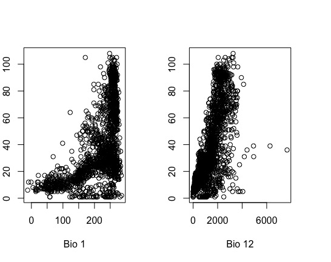
#### 空间自相关
现在，我们认为相关性不是简单的因果关系，因此要探索这种关系，我们需要构建拟合模型。为了探索这种关系，我们将首先探索一个简单的**普通最小二乘回归**（OLS）。（就是利用最小二乘法进行线性回归）
```r
fols <- lm(f_ras_rich ~ f_ras_bio1 + f_ras_bio12, data = fdata)
summary(fols)
#Adjusted R-squared:  0.493
```
接着计算它们物种丰富度以及残差之间的空间相关性：
```r
#计算空间自相关
autocor_SR <- ncf::correlog(fdata$x, fdata$y, z = fdata$f_ras_rich, na.rm = T, 
                         increment = 1, resamp = 1)
#绘图
{plot(autocor_SR$correlation[1:50], type = "b", pch = 1, cex = 1.2, lwd = 1.5,
     ylim = c(-1, 1), xlab = "Distance class", ylab = "Moran's I", cex.lab = 1.2, 
     cex.axis = 1.2)
     abline(h = 0)}
#接下来考察残差中的空间自相关
coords <- fdata[1:2]
coords <- as.matrix(coords)
#通过距离计算领域间的连续性
nb1.5 <- dnearneigh(coords, 0, 1.5)
#通过领域连续性为相邻列表建立空间权重
nb1.5.w <- nb2listw(nb1.5, glist = NULL, style = "W", zero.policy = TRUE)
#从OLS中提取残差
residuals_ols <- residuals(fols)
#绘图
plot(residuals_ols)
#计算单变量空间相关图。
autocor_ols_res <- correlog(fdata$x, fdata$y, z = residuals(fols), 
                            increment = 1, resamp = 1)
#并绘制残差的自相关图
{plot(autocor_ols_res$correlation[1:50], type = "b", pch = 1, cex = 1.2, lwd = 1.5,
     ylim = c(-0.5, 1), xlab = "distance", ylab = "Moran's I", cex.lab = 1.5, 
     cex.axis = 1.2)
abline(h = 0)
title(main = "OLS residuals", cex = 1.5)}
```
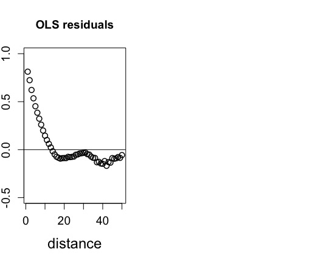
似乎残差具有很强的空间自相关，这是一个问题，因为如果我们在残差中发现自相关，我们获得的大部分解释都可能会产生偏差。那我们接着检查这两个自相关的图。
```r
{par(mfrow = c(2, 1))

plot(autocor_SR$correlation[1:50], type = "b", pch = 1, cex = 1.2, lwd = 1.5,
     ylim = c(-1, 1), xlab = "Distance class", ylab = "Moran's I", cex.lab = 1.2, 
     cex.axis = 1.2)
abline(h = 0)
title(main = "OLS model", cex = 1.5)
plot(autocor_ols_res$correlation[1:50], type = "b", pch = 1, cex = 1.2, lwd = 1.5,
     ylim = c(-0.5, 1), xlab = "Distance class", ylab = "Moran's I", cex.lab = 1.5, 
     cex.axis = 1.2)
abline(h = 0)
title(main = "OLS residuals", cex = 1.5)}
```
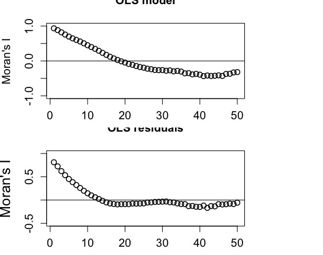
存在很强的空间自相关，因此使用OLS模型的任何结论都可能存在偏差。为了尝试解决这个重要问题，我们将使用**空间同时自回归误差模型估计（Aka SAR模型）**，该模型通过以空间权重矩阵的形式添加额外的项（自回归）来说明空间自相关。其会指定每个单元格或像素的邻域以及每个邻居的相对权重。
```r
#Aka SAR模型
sar_nb1.5.w <- errorsarlm(fols, listw = nb1.5.w, data = fdata, quiet = FALSE, 
                          zero.policy = TRUE)
summary(sar_nb1.5.w)
#AIC: 10931, (AIC for lm: 14495)
residuals_sar_nb1.5.w <- residuals(sar_nb1.5.w)
```
那么它的空间自相关结果怎么样呢？
```r
#计算
autocor_sar_nb1.5.w <- correlog(fdata$x, fdata$y, z = residuals(sar_nb1.5.w), 
                                na.rm = T, increment = 1, resamp = 1)
#绘图
{plot(autocor_sar_nb1.5.w$correlation[1:50], type = "b", pch = 4, cex = 1.2, lwd = 1.5,
     ylim = c(-0.5, 1), xlab = "distance", ylab = "Moran's I", cex.lab = 1.5, 
     cex.axis = 1.2)
abline(h = 0)
title(main = "Correlogram SARerr", cex = 1.5)}
#和线性回归的一起比较绘图
{par(mfrow = c(2, 1))
plot(autocor_ols_res$correlation[1:50], type = "b", pch = 1, cex = 1.2, lwd = 1.5,
     ylim = c(-0.5, 1), xlab = "distance", ylab = "Moran's I", cex.lab = 1.5, 
     cex.axis = 1.2)
abline(h = 0)
title(main = "OLS residuals", cex = 1.5)

plot(autocor_sar_nb1.5.w$correlation[1:50], type = "b", pch = 4, cex = 1.2, lwd = 1.5,
     ylim = c(-0.5, 1), xlab = "distance", ylab = "Moran's I", cex.lab = 1.5, 
     cex.axis = 1.2)
abline(h = 0)
title(main = "Correlogram SARerr", cex = 1.5)}
```
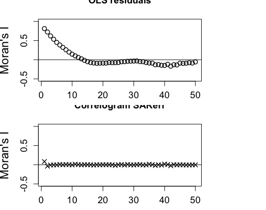
那是真的没有相关。
但是很奇怪的是，SAR模型没有R square，因此我们使用别的函数：
```r
#加载来源不明的函数
source("https://raw.githubusercontent.com/jesusNPL/BetaDivNA/master/SARr2.R")
SARr2(Lfull = sar_nb1.5.w$LL, Lnull = sar_nb1.5.w$logLik_lm.model, N = nrow(fdata))
#'log Lik.' 0.8852386 (df=4)
```
[返回目录](#%e7%94%9f%e7%89%a9%e5%9c%b0%e7%90%86%e5%ad%a6)
## 物种分布与生态位模型
在本实验中，我们将探索一些相关模型，这些模型使用物种级别的数据（地理分布）和大空间尺度的环境数据。我们将使用世界上最大的金刚鹦鹉——风信子金刚鹦鹉（*Anodorhynchus hyacinthinus*）的地理分布数据，该数据分布在玻利维亚和巴西的潘塔纳尔湿地和巴西的塞拉多之间。环境数据可从**Ecoclimate**（http://ecoclimate.org）获得。也可以从WorldClim获取环境数据。
首先准备程序与数据：
```r
#加载包
library(permute)
library(lattice)
library(vegan)
library(sp)
library(raster)
library(psych)
library(maps)
library(maptools)
library(kernlab)
library(dismo)
#加载气候数据
datoG0 <- read.table("Data/Environment/bio_var_CCSM_0k_global.txt", h = T)
#查看气候数据结构
head(datoG0)
datoG0[1:5, 1:5]
dim(datoG0)
str(datoG0)
summary(datoG0)
class(datoG0)
names(datoG0)
#把data.frame的数据变成raster栅格
gridded(datoG0) <- ~long+lat
class(datoG0)
#stake()函数可以改为栅格
clima0k <- stack(datoG0)
#绘制在世界地图上
plot(clima0k$bio.1)
map(add = T)
```
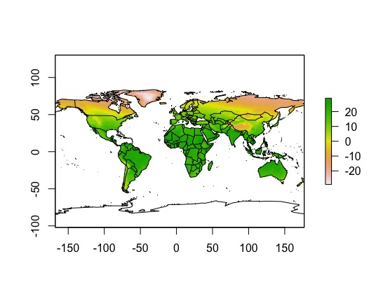
上图对应世界各地的环境变量的年平均温度即BIO1。
但是，我们不需要世界各地的所有环境信息，因为我们的重点物种仅在南美分布（如果该物种位于美国或欧洲的动物园中，并不意味着该物种就存在于那些地方）。
```r
#按经纬度裁剪
e <- extent(c(-90, -30, -60, 15))
clima0k.SA <- crop(clima0k, e)
plot(clima0k.SA$bio.9)
map(add = T)
#看看里面有几个小格子(grid)
ncell(clima0k.SA)
```
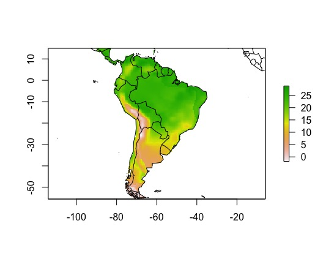
```r
SA0k <- values(clima0k.SA)
class(SA0k)
#获得每个小格的经纬度坐标
coord.SA <- xyFromCell(clima0k.SA, 1:ncell(clima0k.SA))
#将这些小格的坐标和气候对应
SA0k <- cbind(coord.SA, SA0k)
#看看数据
SA0k[1:5,]
SA0k[1:5, 1:5]
```
现在，我们需要确定需要哪些变量来建模风信子金刚鹦鹉的生态位（格林纳利生态位或基础生态位）。在这里，我们可以依靠专家进行选择或使用统计工具或同时使用这两种工具。
在这种情况下，我们将使用心理学中通常使用的阶乘分析。
```r
#执行阶乘分析
fa.parallel(SA0k[, -c(1:3)])
```
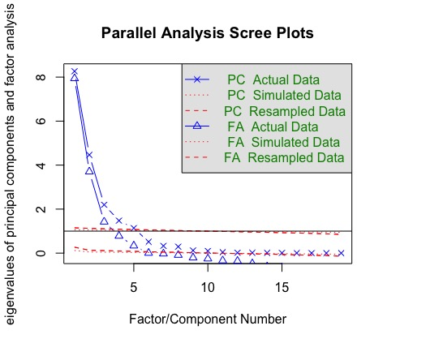
平行分析表明，因子的数量= 5和组件的数量= 5足以进行进一步分析。
```r
SA0k.fa <- fa(SA0k[, -c(1:3)], nfactors = 5, rotate = "varimax")
SA0k.fa
loadings(SA0k.fa)
```
根据FA(阶乘)的结果和专业知识，我们可以选择进行计算变量：bio1，bio2，bio15，bio4，bio2。接着我们保存变量并加载物种数据：（从**GBIF**中）
```r
#保存我们选出的变量
write.table(SA0k[, c("x", "y", "bio.1", "bio.2", "bio.4", "bio.12", "bio.15")],
            row.names = FALSE, "Data/Environment/climaSA0k.txt", sep = "\t")
#作为栅格保存
writeRaster(clima0k.SA, "Data/Environment/climaSA0k.asc", format = "ascii", bylayer = T)
#清理r环境
rm(list = ls())
#直接从R中从GBIF获取我们物种的一些发生数据。考虑到所选物种的发生次数，这可能需要一些时间和网速。
hyacinth <- gbif("anodorhynchus", "hyacinthinus*", geo = FALSE)
#查看并选择有经纬度的数据列
dim(hyacinth)
colnames(hyacinth)
#整理数据
#去NA
hyacinth <- subset(hyacinth, !is.na(lon) & !is.na(lat))
dim(hyacinth)
hyacinth[1:4, c(1:5, 7:10)]
#其次，仅选择建模对象所需的列。
#请注意，使用colnames(风信子鹦鹉)可以获取列的位置，并且114、84和77列（按此顺序）分别是对应于物种名称，经度和纬度的列，这就是我们所需要的。
hyacinth_coords <- hyacinth[, c(114, 84, 77)]
head(hyacinth_coords)
#保存
dir.create("Data/OCC")
write.csv(hyacinth_coords, "Data/OCC/hyacinth_data.csv")
#再清理一下运行环境
rm(list = ls())
#合并物种分布与环境数据
hyacinth <- read.csv("Data/OCC/hyacinth_data.csv")
head(hyacinth)
#只有一个物种，就不要物种名字了
hyacinth_coords <- hyacinth[, c(3, 4)]
head(hyacinth_coords)
#加载环境数据
climSA0k <- read.table("Data/Environment/climaSA0k.txt", h = T)
class(climSA0k)
gridded(climSA0k) <- ~x + y
climSA0k <- stack(climSA0k)
climSA0k
#将其绘制在地图上
plot(climSA0k$bio.1)
points(hyacinth_coords[, "lon"], hyacinth_coords[, "lat"])
#匹配物种分布数据和气象数据
hyacinth_var <- extract(climSA0k, hyacinth_coords, cellnumbers = T)
head(hyacinth_var)
hyacinth_var <- cbind(hyacinth_coords, hyacinth_var)
hyacinth_var[1:5, ]
#把NA数据去了
hyacinth_var <- na.omit(hyacinth_var) # remove NA's
dim(hyacinth_var)
#删除单元格中重复的值
duplicated(hyacinth_var[,"cells"])
a <- which(duplicated(hyacinth_var[, "cells"]) == T)
a
hyacinth_var <- hyacinth_var[-a, ]
dim(hyacinth_var)
#保存
write.table(hyacinth_var, row.names = FALSE, "Data/OCC/hyacinth_var.txt", sep = "\t")
#画在地图上
plot(climSA0k$bio.1)
points(hyacinth_var[, "lon"], hyacinth_var[, "lat"])
#整理数据作为背景数据集
clima0k <- read.table("Data/Environment/climaSA0k.txt", h = T)
dim(clima0k)
#123就是有123个分布点
id.back <- sample(1:nrow(clima0k), 123) 
length(id.back)
dim(background)
names(background)
#保存
write.table(background, "Data/Environment/background.txt", row.names = F, sep = "\t")
```
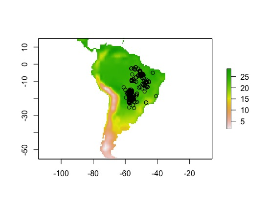
### 生态位模型的拟合与预测
有了这些数据我们就可以开始演算了。
先通过环境背景数据和物种分布数据设置测试集合训练集.
```r
#准备数据
id.ocur <- sample(1:nrow(hyacinth_var), round(0.75*nrow(hyacinth_var)))
length(id.ocur)
id.back <- sample(1:nrow(background), round(0.75*nrow(background)))
length(id.back)
#准备训练集
training <- prepareData(x = climSA0k, 
                             p = hyacinth_var[id.ocur, 1:2], 
                             b = background[id.back, 1:2], xy = T)
#准备测试集
test <- prepareData(x = climSA0k, 
                      p = hyacinth_var[-id.ocur, 1:2], 
                      b = background[-id.back,1:2], xy = T)
```
接着我们用不同的模型用训练集去预测其生态位分布:
可以使用各种模型来探索物种如何对这些特定变量做出响应（基于我们使用的特定算法以及地理和环境空间之间的关系），使用一个为每个变量创建响应图的响应函数，以及其他函数变量的中位数。
同时，我们将评估每个模型的性能。为了评估模型的性能，我们将使用测试数据。对所有四个模型重复以上操作。
使用存在/不存在数据对模型进行交叉验证。给定存在向量和不存在值的向量（或模型以及存在和不存在点以及预测变量），将计算混淆矩阵（针对变化的阈值），并为每个混淆矩阵/阈值计算模型评估统计量。
最后可以为每个模型设置阈值，阈值（截止值）用于将模型预测（概率，距离或相似值）转换为二进制分数（存在或不存在）。
#### Bioclim模型
BIOCLIM算法通过将任意位置的环境变量的值与已知发生位置（“训练地点”）的值的百分比分布进行比较，来计算位置的相似度。
```r
Bioclim.model <- bioclim(x = training[training[, "pb"] == 1, -c(1:3)]) 
Bioclim.model
plot(Bioclim.model)
```
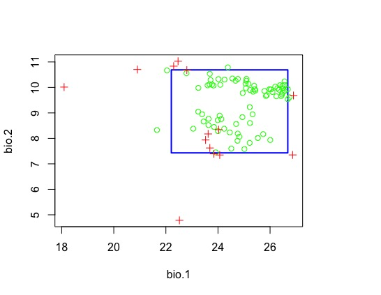
让我们绘制模型的响应变量或单个变量响应曲线。
```r
response(Bioclim.model)
```
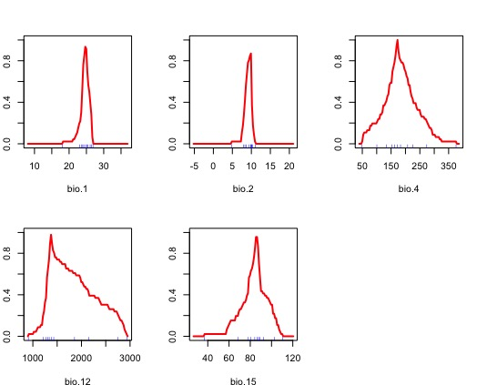
进行分布区预测
```r
Bioclim0k <- predict(object = Bioclim.model, x = climSA0k)
plot(Bioclim0k)
#加入现在的实际分布点
points(training[training[, "pb"]==1,"x"], training[training[, "pb"]==1,"y"])
```
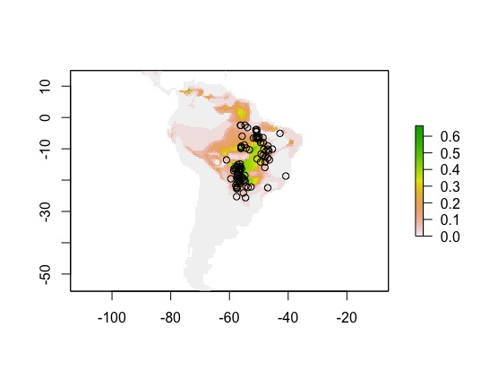
测试数据
```r
Bioclim.eval <- evaluate(p = test[test[, "pb"] == 1, 1:2], 
                         a = test[test[, "pb"] == 0, 1:2], 
                         model = Bioclim.model, 
                         x = climSA0k)
Bioclim.eval
#AUC: 0.8319892 
str(Bioclim.eval)
#设置阈值
Bioclim.thr <- threshold(Bioclim.eval)
Bioclim.thr
```
“thr”对象中有不同的列，每个列都是阈值的度量，在本示例中，我们将使用“ spec_sens”列（物种敏感度）。
在spec_sens中，阈值为灵敏度（真阳性率）和特异性（真阴性率）之和最高的值。
```r
bio <- Bioclim.thr$spec_sens
```
#### Gower模型
域算法计算任何位置的环境变量与已知的任何发生位置（“训练地点”）之间的高尔距离。对于每个变量，均采用站点与任何训练点之间的最小距离。
```r
Gower.model <- domain(x = training[training[, "pb"] == 1, -c(1:3)])
Gower.model
response(Gower.model)
#预测
Gower0k <- predict(climSA0k, Gower.model)
plot(Gower0k)
#验证
Gower.eval <- evaluate(p = test[test[, "pb"] == 1, 1:2], 
                       a = test[test[, "pb"] == 0, 1:2], 
                       model = Gower.model, 
                       x = climSA0k)
#查看阈值
Gower.thr <- threshold(Gower.eval)
gow <- Gower.thr$spec_sens
```
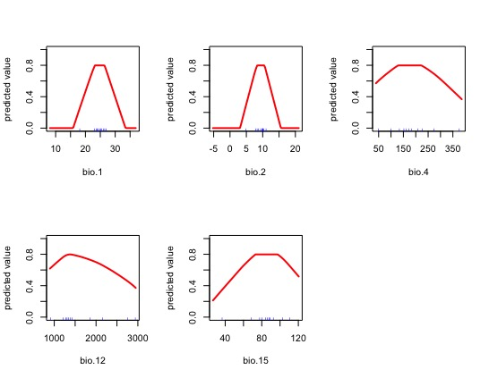
#### 支持向量机SVM
支持向量机是用于分类，独立性检测和回归的出色工具。
支持向量机（SVMs;Vapnik,1998）将简单的线性方法应用于数据，但是在与输入空间非线性相关的高维特征空间中，但实际上，它不涉及该高维中的任何计算空间。这种简单性与在许多学习问题（分类，回归和独立性检测）上的先进技术相结合，促进了SVM的普及（Karatzoglou等，2006）。
```r
svm.model <- ksvm(pb ~ bio.1 + bio.2 + bio.4 + bio.12 + bio.15, data = training)
#预测
svm0k <- predict(climSA0k, svm.model)
plot(svm0k)
#验证
svm.eval <- evaluate(p = test[test[, "pb"] == 1, 1:2], 
                     a = test[test[, "pb"] == 0, 1:2], 
                     model = svm.model, 
                     x = climSA0k)
#查看阈值
svm.thr <- threshold(svm.eval)
s <- svm.thr$spec_sens
```
#### 广义线性模型
广义线性模型（GLM）是普通最小二乘回归的广义。 使用最大似然并通过允许线性模型通过链接函数与响应变量相关以及通过允许每次测量的方差大小为其预测值的函数来拟合模型。根据GLM的指定方式，它可以等同于（多次）线性回归，逻辑回归或泊松回归。
```r
glm.model <- glm(pb ~ bio.1 + bio.2 + bio.4 + bio.12 + bio.15, 
                  data = training, family = binomial(link = "logit"))
#预测
GLM0k <- predict(climSA0k, glm.model)
plot(GLM0k)
#验证
glm.eval <- evaluate(p = test[test[, "pb"] == 1, 1:2], 
                     a = test[test[, "pb"] == 0, 1:2], 
                     model = glm.model, 
                     x = climSA0k)
#查看阈值
glm.thr <- threshold(glm.eval)
g <- glm.thr$spec_sens
```
比较4张图
```r
par(mfrow = c(2, 2))
plot(Bioclim0k, main = "bioclim")
plot(Gower0k, main = "Gower")
plot(svm0k, main = "svm")
plot(GLM0k, main = "glm")
```
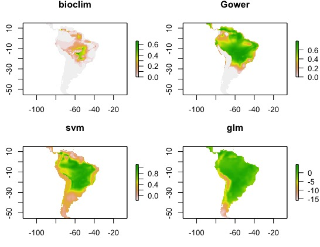
比较四个模型的ROC值
```r
par(mfrow = c(2, 2))
plot(Bioclim.eval, "ROC")
plot(Gower.eval, "ROC")
plot(svm.eval, "ROC")
plot(glm.eval, "ROC")
```
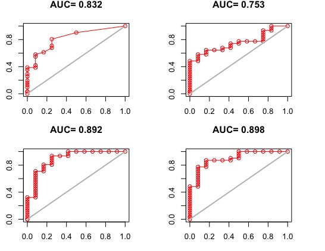
添加了阈值限制后的物种适宜分布区
```r
par(mfrow = c(2, 2))
plot(Bioclim0k > bio, main = "Bioclim")
plot(GLM0k > g, main = "GLM")
plot(Gower0k > gow, main = "Gower")
plot(svm0k > s, main = "SVM")
```
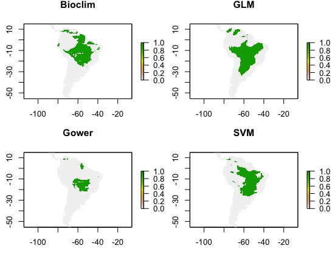
可以综合这四个数值以获得平均的结果/综合的结果
```r
thrs <- (bio + gow + s + g)
#stack()为堆叠函数
tmp <- stack(Bioclim0k, Gower0k, GLM0k, svm0k)
map.sum <- sum(tmp)
par(mfrow = c(2, 2))
plot(map.sum)
plot(map.sum > thrs)
plot(map.sum > 2)
plot(map.sum > 3)
```
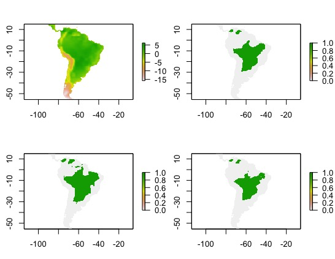
也可以查看他们的平均结果
```r
map.mean <- mean(tmp)
map.sd <- calc(tmp, sd)
par(mfrow = c(2, 2))
plot(map.mean)
plot(map.mean > thrs)
plot(map.mean > 0.2)
plot(map.mean > 0.3)
```

但是，这是一个有问题的方法，因为模型预测的值并不都在相同的范围（0到1）之间。所以您可能要先解决它。解决方案是添加权重。让我们结合按其AUC分数加权的四个模型。在这里，为了创建权重，我们减去0.5（随机期望）并将结果平方，以为更高的AUC值赋予更多权重。
```r
auc <- sapply(list(Bioclim.eval, Gower.eval, svm.eval, glm.eval), function(x) x@auc)
w <- (auc-0.5)^2
map.mean.weight <- weighted.mean(tmp[[c("layer.1", "layer.2", "layer.3", "layer.4")]], w)
plot(map.mean.weight)
par(mfrow = c(2, 2))
plot(map.sum, main = "Sum of all models")
plot(map.mean, main = "Mean of all models")
plot(map.mean.weight, main = "Weighted mean of all models")
plot(map.sd, main = "Standard deviation of all models")
```
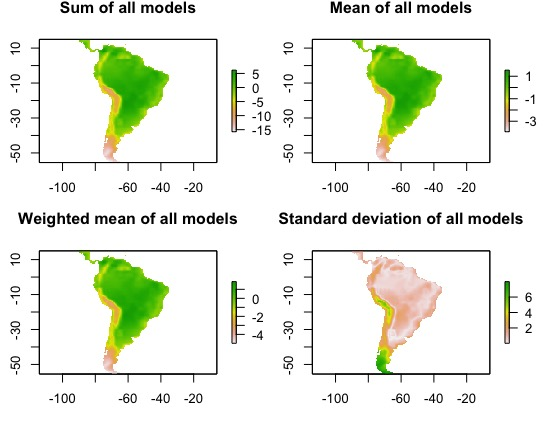
[返回目录](#%e7%94%9f%e7%89%a9%e5%9c%b0%e7%90%86%e5%ad%a6)
## 运用光谱数据调查生物多样性
在本实验中，我们随便研究一下“光谱数据”。为此，我们将使用R包**spectrolab**和其中存储的数据。spectrolab是一个R包，用于处理和可视化来自便携式光谱仪的数据，并建立通用的光谱信息接口。处理光谱信息/数据与处理任何其他信息（例如物种，社区）没什么不同似，因此可以用于计算任何多样性指标，即称为"光谱多样性"的生物多样性维度。
Jesús对这个算法进行了一些修改和补充，但基本上是基于spectrolab软件包的说明（https://cran.r-project.org/web/packages/spectrolab/vignettes/introduction_to_spectrolab.pdf）。也感谢感谢Dudu（JoséEduardo Meireles）使光谱数据易于处理。
首先准备各种数据和软件：
```r
#安装包
install.packages("spectrolab", dependencies = TRUE)
library(spectrolab)
#有两种方法可以使光谱进入R：
#1）将矩阵或数据框转换为光谱；
#2）从原始数据文件（格式：SVC的sig，Spectral Evolution的sed和ASD的asd）中读取光谱。 这是几个例子：
#这是一个使用spectrolab软件包提供的名为spec_matrix_meta.csv的数据集矩阵的示例。
#从csv中读取数据，但不用check.names = FALSE
dir_path <- system.file("extdata/spec_matrix_meta.csv", package = "spectrolab")
spec_csv <- read.csv(dir_path, check.names = FALSE)
head(spec_csv)
#将光谱转为R的矩阵或数据框后，就可以使用函数as.spectra()将其转换为光谱对象。
#矩阵必须在行中具有样本，在列中必须具有波长。波长列的标题必须是（数字）波长标签。
#您还应该使用name_idx参数声明哪一列具有样品名称（必填）。 如果存在其他列（样品名称和反射率除外），则必须将其索引作为meta_idxs参数传递给as.spectra。
#1,2列为元数据，3为样本列
achillea_spec = as.spectra(spec_csv, name_idx = 3, meta_idxs = c(1, 2))
#这就是光谱数据
achillea_spec
#找到自带的样本数据
dir_path <- system.file("extdata", "Acer_example", package = "spectrolab")
#读取波段数据（.sig格式）
acer_spectra <- read_spectra(path = dir_path, format = "sig")
#查看数据
acer_spectra
#查看维度？波段？
dim(acer_spectra)
#你可以访问光谱的各个组成部分。
#查看样本名称，允许重复
n <- names(achillea_spec)
#查看波长数据
w <- wavelengths(achillea_spec)
#查看反射率矩阵
r <- reflectance(achillea_spec)
#meta()代表相关的元数据（如果你有的话）
m <- meta(achillea_spec, "ssp", simplify = TRUE)
```
您可以使用类似于矩阵和data.frames中使用的[i，j]函数的符号对光谱信息进行子集（分波段）化。[i，]中的第一个参数匹配样本名称（行），而第二个参数[，j]匹配波长名称（列）。以下是”["在频谱中的工作方式的一些示例：
•x [1：3，]将保留x的前三个样本，即1：3为索引。
•x [“ sp_1”，]将样本名称与“ sp_1”匹配的所有条目保留在x中。
•x [，800：900]将保持800至900之间的波长。
•x [，1：5]将报错，因为波长不能通过索引子集。
通过子集，你可以排除频谱开始和结尾的嘈杂区域，或者将数据限制为特定的波段。
但某些光谱的分辨率可能不同于1nm，就像SVC一样。在这些情况下，最好的方法是使用光谱的最小和最大参数来标准化光谱。
同时通过索引对样本进行子集的划分是可行的，通过数字或字符对波长进行子集设置也可以实现
```r
#按波长和样本进行匹配
spec_sub_vis <- achillea_spec[ , 400:700 ]
spec_sub_byname <- achillea_spec["ACHMI_7", ]
spec_sub_byidx <- achillea_spec[ 1:3, ]
#标准化光谱
acer_spectra_trim <-  acer_spectra[ , wavelengths(acer_spectra, 400, 2400) ]
#通过参数划设子集
spec_sub_byidx[1, "405"] == spec_sub_byidx[1, 405]
```
也可以将光谱图转为矩阵或data.frame。
也可以使用as.matrix()或as.data.frame()函数将光谱对象转换为矩阵或data.frame。因为我们经常要以特定格式（例如csv）导出数据。
```r
#从spectra生成一个矩阵
spec_as_mat = as.matrix(achillea_spec, fix_names = "none")
spec_as_mat[1:4, 1:3]
#生成一个矩阵
spec_as_df = as.data.frame(achillea_spec, fix_names = "none", metadata = TRUE)
spec_as_df[1:4, 1:5]
```
### 获取波段图谱
绘制光谱的主要功能是**plot()**。它将在光谱对象中共同绘制每个光谱。 您应该能够将常用的绘图参数传递给它，例如col，ylab，lwd等:
```r
#简单绘制
plot(achillea_spec, lwd = 0.75, lty = 1, col = "grey25", main = "All Spectra")
```
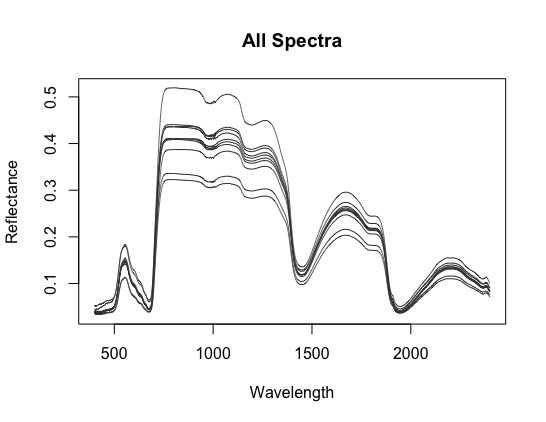
您还可以使用plot_quantile()绘制光谱对象的分位数。第二个参数total_prob是分位数包含的总“质量”。例如，total_prob = 0.95涵盖了光谱对象中95％的变化，即0.025至0.975分位数。 如果add = TRUE，则分位数图可以单独使用，也可以添加到当前图中。
```r
plot_quantile(achillea_spec, total_prob = 0.8, col = rgb(1, 0, 0, 0.5), lwd = 0.5, border = TRUE)
title("80% spectral quantile")
```
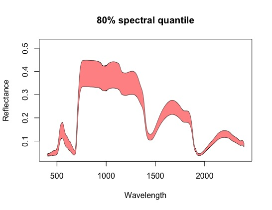
函数plot_regions()有助于阴影不同的光谱区域。spectrolab提供了一个default_spec_regions()矩阵作为示例，但显然需要对其进行自定义（有关详细信息，请参见plot_regions的帮助页面）。
```r
#结合了单个光谱，分位数和阴影光谱区域的图
plot(achillea_spec, lwd = 0.25, lty = 1, col = "grey50", main = "Spectra, quantile and regions")
plot_quantile(achillea_spec, total_prob = 0.8, col = rgb(1, 0, 0, 0.25), border = FALSE, add = TRUE)
plot_regions(achillea_spec, regions = default_spec_regions(), add = TRUE)
```
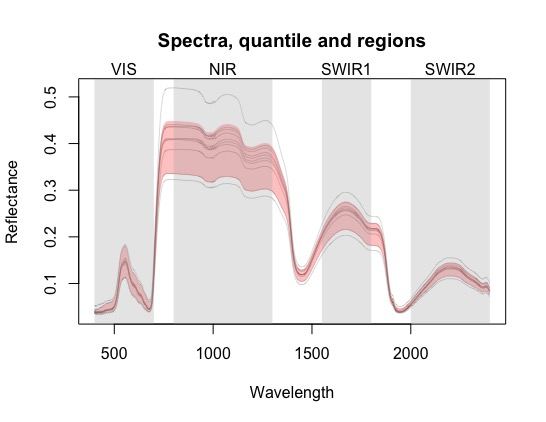
### 基于遥感的生态指标
请注意，光谱范围为400到2400，以下我们将光谱数据分为不同的光谱。 这些是**VIS（可见光）**或，**NIR（近红外）**或，**SWIR1**和**SWIR2**为短波红外。
```r
VIS <- c(400:700)
NIR <- c(800:1300)
SWIR1 <- c(1550:1800)
SWIR2 <- c(2000:2400)
#VIS
achillea_spec_VIS <- achillea_spec[, VIS]
achillea_spec_VIS
achillea_spec_VIS_df <- as.data.frame(achillea_spec_VIS, fix_names = "none", metadata = TRUE)
achillea_spec_VIS_df[1:10, 1:5]
#可以绘制出来，其他波段也可以如法炮制
plot(achillea_spec_VIS, lwd = 0.75, lty = 1, col = "grey25", main = "Visible")
#删除前3列以进一步分析
spec_as_df_clean <- spec_as_df[, 4:2004]
spec_as_df_clean[1:10, 1:5]
#选择光谱数据
achillea_spec_VIS_df_clean <- achillea_spec_VIS_df[, 4:304]
achillea_spec_VIS_df_clean[1:10, 1:5]
#例如选择ACHMI的第一行。结果是规格为1行和2001列的data.frame。
spec_as_df_clean_ind1 <- spec_as_df_clean[1, ]
dim(spec_as_df_clean_ind1)
spec_as_df_clean_ind1
```
现在让我们计算一些描述性统计信息以更好地理解数据。可以自己做，但是Jesús准备了一个函数来自动进行此计算。其称为**Descriptives()**，您只需要输入值即可。
```r
source("mixR.R")
Descriptives(as.numeric(spec_as_df_clean_ind1))
```
现在可以为其他对象重复该过程，并查看与Achillea的区别。请注意，函数**Descriptives()**可以在**for**循环中使用，但是也可以使用**apply**函数。此函数将特定函数应用于矩阵或data.frame。
```r
descript_all_individuals <- apply(spec_as_df_clean, MARGIN = 1, FUN = Descriptives)
descript_all_individuals[[10]]
```
最后，我们将计算一些植被指数：
1.简单植被指数：SR = Rnir / Rr
其中：R =反射率，nir =波段845，r =波段665。
2.归一化植被指数：NDVI =（Rnir-Rr）/（Rnir + Rr）
其中：nir = 845和r = 665。
3.光化学反射指数：PRI ＝（R531-R570）/（R531 + R570）。这些数字分别对应于531和570波段，R是反射率。
4.归一化水文指数：NDWI =（R860-R1240）/（R860 + R1240）
5.水平衡指数：WBI = R900 / R970。
```r
SR_achillea = spec_as_df[, "845"]/spec_as_df[, "665"]
SR_achillea
```

## 物种分布模型包:biomod2
一个很厉害的包...不单单可以拟合环境数据等连续性变量，还可以拟合基因标记等二项分布的变量。
物种分布模型本质上就是一个概率模型，建立每个栅格（地理位置）对于的环境变量与其存在概率之间的函数关系来估计物种分布的可能性。
### 准备biomod2
```r
#设置工作环境
setwd('workdir')
#安装biomod2
devtools::install_github('biomodhub/biomod2')
#加载
library(biomod2)
library(ggplot2)
library(gridExtra)
library(raster)
library(rasterVis)
#加载数据
ProLau_occ <- read.csv('../data/ProLau_occ.csv')
summary(ProLau_occ)
#加载各种数据...
bioclim_ZA_sub <- 
  raster::stack(
    c(
      bio_5  = '../data/worldclim_ZA/worldclim_ZA_bio_5.asc',
      bio_7  = '../data/worldclim_ZA/worldclim_ZA_bio_7.asc',
      bio_11 = '../data/worldclim_ZA/worldclim_ZA_bio_11.asc',
      bio_19 = '../data/worldclim_ZA/worldclim_ZA_bio_19.asc'
    )
  )

bioclim_ZA_sub

#整理数据
ProLau_data <- 
  BIOMOD_FormatingData(
    resp.var = ProLau_occ['Protea.laurifolia'],
    resp.xy = ProLau_occ[, c('long', 'lat')],
    expl.var = bioclim_ZA_sub,
    resp.name = "Protea.laurifolia",
    PA.nb.rep = 2,
    PA.nb.absences = 500,
    PA.strategy = 'random'
  )
```
运行物种分布模型
```r
ProLau_data
#绘制伪缺席图
plot(ProLau_data)
```
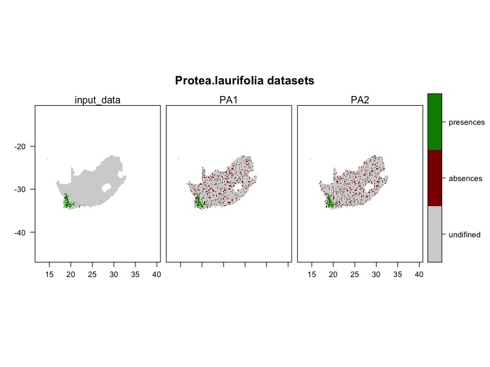
```r
#定义单个模型的选项
ProLau_opt <- 
  BIOMOD_ModelingOptions(
    GLM = list(type = 'quadratic', interaction.level = 1),
    GBM = list(n.trees = 1000),
    GAM = list(algo = 'GAM_mgcv')
  )
#跑模型
ProLau_models <- 
  BIOMOD_Modeling(
    data = ProLau_data,
    models = c("GLM", "GBM", "RF", "GAM"),
    models.options = ProLau_opt,
    NbRunEval = 2,
    DataSplit = 80,
    VarImport = 3,
    modeling.id = "demo1"
  )

#评估单个模型的质量

#获取模型评估分数
ProLau_models_scores <- get_evaluations(ProLau_models)

## ProLau_models_scores是一个包含模型分数的5维数组
dim(ProLau_models_scores)
dimnames(ProLau_models_scores)

# 绘出模型评估分数
models_scores_graph(
  ProLau_models, 
  by = "models", 
  metrics = c("ROC","TSS"), 
  xlim = c(0.5,1), 
  ylim = c(0.5,1)
)

models_scores_graph(
  ProLau_models, 
  by = "cv_run" , 
  metrics = c("ROC","TSS"), 
  xlim = c(0.5,1), 
  ylim = c(0.5,1)
)

models_scores_graph(
  ProLau_models, 
  by = "data_set", 
  metrics = c("ROC","TSS"), 
  xlim = c(0.5,1), 
  ylim = c(0.5,1)
)

#检查各个变量的重要值
(ProLau_models_var_import <- get_variables_importance(ProLau_models))

#求变量重要性的平均值
apply(ProLau_models_var_import, c(1,2), mean)

#绘制模型的响应图
ProLau_glm <- BIOMOD_LoadModels(ProLau_models, models='GLM')
ProLau_gbm <- BIOMOD_LoadModels(ProLau_models, models='GBM')
ProLau_rf <- BIOMOD_LoadModels(ProLau_models, models='RF')
ProLau_gam <- BIOMOD_LoadModels(ProLau_models, models='GAM')

glm_eval_strip <- 
  biomod2::response.plot2(
    models  = ProLau_glm,
    Data = get_formal_data(ProLau_models,'expl.var'), 
    show.variables= get_formal_data(ProLau_models,'expl.var.names'),
    do.bivariate = FALSE,
    fixed.var.metric = 'median',
    legend = FALSE,
    display_title = FALSE,
    data_species = get_formal_data(ProLau_models,'resp.var')
  )

gbm_eval_strip <- 
  biomod2::response.plot2(
    models  = ProLau_gbm,
    Data = get_formal_data(ProLau_models,'expl.var'), 
    show.variables= get_formal_data(ProLau_models,'expl.var.names'),
    do.bivariate = FALSE,
    fixed.var.metric = 'median',
    legend = FALSE,
    display_title = FALSE,
    data_species = get_formal_data(ProLau_models,'resp.var')
  )

rf_eval_strip <- 
  biomod2::response.plot2(
    models  = ProLau_rf,
    Data = get_formal_data(ProLau_models,'expl.var'), 
    show.variables= get_formal_data(ProLau_models,'expl.var.names'),
    do.bivariate = FALSE,
    fixed.var.metric = 'median',
    legend = FALSE,
    display_title = FALSE,
    data_species = get_formal_data(ProLau_models,'resp.var')
  )

gam_eval_strip <- 
  biomod2::response.plot2(
  models  = ProLau_gam,
  Data = get_formal_data(ProLau_models,'expl.var'), 
  show.variables= get_formal_data(ProLau_models,'expl.var.names'),
  do.bivariate = FALSE,
  fixed.var.metric = 'median',
  legend = FALSE,
  display_title = FALSE,
  data_species = get_formal_data(ProLau_models,'resp.var')
)
```
如随机森林的变量响应模型：
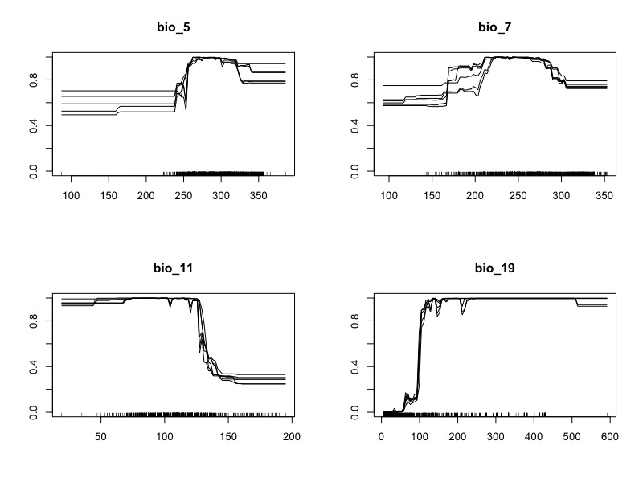
```r
#运行集成模型
ProLau_ensemble_models <- 
  BIOMOD_EnsembleModeling(
    modeling.output = ProLau_models,
    em.by = 'all',
    eval.metric = 'TSS',
    eval.metric.quality.threshold = 0.8,
    models.eval.meth = c('TSS','ROC'),
    prob.mean = FALSE,
    prob.cv = TRUE, 
    committee.averaging = TRUE,
    prob.mean.weight = TRUE,
    VarImport = 0
  )

#评估集成模型质量
(ProLau_ensemble_models_scores <- get_evaluations(ProLau_ensemble_models))
```
### 单变量模型拟合与预测
```r
#当前适宜区？
ProLau_models_proj_current <- 
  BIOMOD_Projection(
    modeling.output = ProLau_models,
    new.env = bioclim_ZA_sub,
    proj.name = "current",
    binary.meth = "TSS",
    output.format = ".img",
    do.stack = FALSE
  )

ProLau_ensemble_models_proj_current <- 
  BIOMOD_EnsembleForecasting(
    EM.output = ProLau_ensemble_models,
    projection.output = ProLau_models_proj_current,
    binary.meth = "TSS",
    output.format = ".img",
    do.stack = FALSE
  )

#预测未来
#加载2050气候
bioclim_ZA_2050_BC45 <-
  stack(
    c(
      bio_5  = '../data/worldclim_ZA/worldclim_ZA_2050_BC45_bio_5.asc',
      bio_7  = '../data/worldclim_ZA/worldclim_ZA_2050_BC45_bio_7.asc',
      bio_11 = '../data/worldclim_ZA/worldclim_ZA_2050_BC45_bio_11.asc',
      bio_19 = '../data/worldclim_ZA/worldclim_ZA_2050_BC45_bio_19.asc'
    )
  )

ProLau_models_proj_2050_BC45 <- 
  BIOMOD_Projection(
    modeling.output = ProLau_models,
    new.env = bioclim_ZA_2050_BC45,
    proj.name = "2050_BC45",
    binary.meth = "TSS",
    output.format = ".img",
    do.stack = FALSE
  )

ProLau_ensemble_models_proj_2050_BC45 <- 
  BIOMOD_EnsembleForecasting(
    EM.output = ProLau_ensemble_models,
    projection.output = ProLau_models_proj_2050_BC45,
    binary.meth = "TSS",
    output.format = ".img",
    do.stack = FALSE
  )

#加载2079气候
bioclim_ZA_2070_BC45 <-
  stack(
    c(
      bio_5  = '../data/worldclim_ZA/worldclim_ZA_2070_BC45_bio_5.asc',
      bio_7  = '../data/worldclim_ZA/worldclim_ZA_2070_BC45_bio_7.asc',
      bio_11 = '../data/worldclim_ZA/worldclim_ZA_2070_BC45_bio_11.asc',
      bio_19 = '../data/worldclim_ZA/worldclim_ZA_2070_BC45_bio_19.asc'
    )
  )

ProLau_models_proj_2070_BC45 <- 
  BIOMOD_Projection(
    modeling.output = ProLau_models,
    new.env = bioclim_ZA_2070_BC45,
    proj.name = "2070_BC45",
    binary.meth = "TSS",
    output.format = ".img",
    do.stack = FALSE
  )

ProLau_ensemble_models_proj_2070_BC45 <- 
  BIOMOD_EnsembleForecasting(
    EM.output = ProLau_ensemble_models,
    projection.output = ProLau_models_proj_2070_BC45,
    binary.meth = "TSS",
    output.format = ".img",
    do.stack = FALSE
  )
#绘制预测图像
plot(ProLau_ensemble_models_proj_2070_BC45, str.grep = "EMca|EMwmean")
```
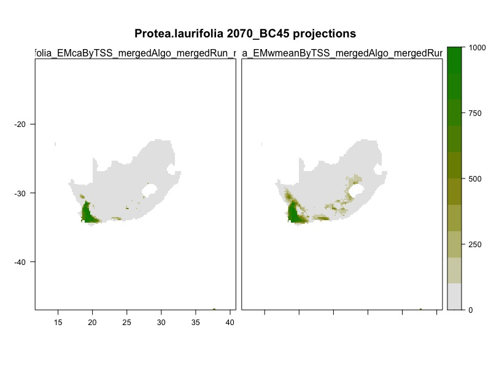
```r
#完成物种变化范围图（Species Range Change (SRC) ）
# 加载投影坐标系
ProLau_bin_proj_current <- 
  stack( 
    c(
      ca = "Protea.laurifolia/proj_current/individual_projections/Protea.laurifolia_EMcaByTSS_mergedAlgo_mergedRun_mergedData_TSSbin.img",
      wm = "Protea.laurifolia/proj_current/individual_projections/Protea.laurifolia_EMwmeanByTSS_mergedAlgo_mergedRun_mergedData_TSSbin.img"
    )
  )

ProLau_bin_proj_2050_BC45 <- 
  stack( 
    c(
      ca = "Protea.laurifolia/proj_2050_BC45/individual_projections/Protea.laurifolia_EMcaByTSS_mergedAlgo_mergedRun_mergedData_TSSbin.img",
      wm = "Protea.laurifolia/proj_2050_BC45/individual_projections/Protea.laurifolia_EMwmeanByTSS_mergedAlgo_mergedRun_mergedData_TSSbin.img"
    )
  )

ProLau_bin_proj_2070_BC45 <- 
  stack( 
    c(
      ca = "Protea.laurifolia/proj_2070_BC45/individual_projections/Protea.laurifolia_EMcaByTSS_mergedAlgo_mergedRun_mergedData_TSSbin.img",
      wm = "Protea.laurifolia/proj_2070_BC45/individual_projections/Protea.laurifolia_EMwmeanByTSS_mergedAlgo_mergedRun_mergedData_TSSbin.img"
    )
  )
#当前至2050的SRC变化
SRC_current_2050_BC45 <- 
  BIOMOD_RangeSize(
    ProLau_bin_proj_current,
    ProLau_bin_proj_2050_BC45
  )

SRC_current_2050_BC45$Compt.By.Models

#当前至2070的SRC变化
SRC_current_2070_BC45 <- 
  BIOMOD_RangeSize(
    ProLau_bin_proj_current,
    ProLau_bin_proj_2070_BC45
  )

SRC_current_2070_BC45$Compt.By.Models

ProLau_src_map <- 
  stack(
    SRC_current_2050_BC45$Diff.By.Pixel, 
    SRC_current_2070_BC45$Diff.By.Pixel
  )
names(ProLau_src_map) <- c("ca cur-2050", "wm cur-2050", "ca cur-2070", "wm cur-2070")

my.at <- seq(-2.5, 1.5, 1)
myColorkey <- 
  list(
    at = my.at, #观察颜色变化的区域
    labels = 
      list(
        labels = c("lost", "pres", "abs","gain"), #符号与备注
        at = my.at[-1] - 0.5 #备注的位置
      )
  )

rasterVis::levelplot( 
  ProLau_src_map, 
  main = "Protea laurifolia range change",
  colorkey = myColorkey,
  col.regions=c('#f03b20', '#99d8c9', '#f0f0f0', '#2ca25f'),
  layout = c(2,2)
)
```
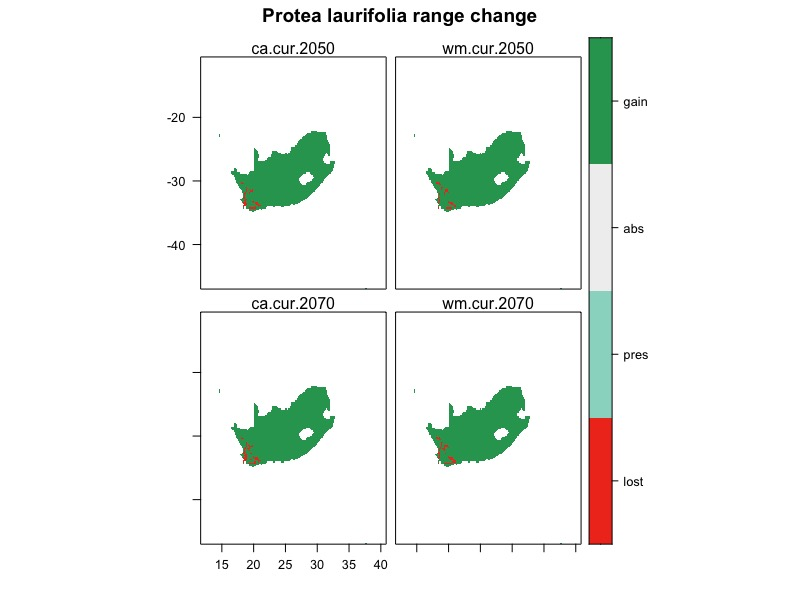
```r
#计算SRC分布概率的分层密度
#参考项目
ref <- subset(ProLau_bin_proj_current, "ca")

#选择研究内容
mods <- c("GLM", "GBM", "RF", "GAM")
data_set <- c("PA1", "PA2")
cv_run <- c("RUN1", "RUN2", "Full")

#构建（模型/对象）组合
groups <- 
  as.matrix(
    expand.grid(
      models = mods, 
      data_set = data_set, 
      cv_run = cv_run,
      stringsAsFactors = FALSE)
  )

#加载我们计算出的投影
all_bin_proj_files <- 
  list.files( 
    path = "Protea.laurifolia",  
    pattern = "_TSSbin.img$",
    full.names = TRUE, 
    recursive = TRUE
  )

#当前与2070年对比（删除了当前和2050年的预测）
current_and_2070_proj_files <- grep(all_bin_proj_files, pattern="2070", value=T)

#只保留与我们选择的镶嵌面组匹配的投影
selected_bin_proj_files <- 
  apply(
  groups, 1, 
    function(x){
      proj_file <- NA
      match_tab <- sapply(x, grepl, current_and_2070_proj_files)
      match_id <- which(apply(match_tab, 1, all))
      if(length(match_id)) proj_file <- current_and_2070_proj_files[match_id]
      proj_file
    }
  )

#删除不匹配的组
to_remove <- which(is.na(selected_bin_proj_files))
if(length(to_remove)){
  groups <- groups[-to_remove,]
  selected_bin_proj_files <- selected_bin_proj_files[-to_remove]
}

#生成选定投影的堆栈图
proj_groups <- stack(selected_bin_proj_files)

ProbDensFunc(
  initial = as.vector(ref),
  projections = raster::as.matrix(proj_groups),
  groups = t(groups),
  plothist = TRUE,
  resolution = 10,
  cvsn = FALSE
)
```
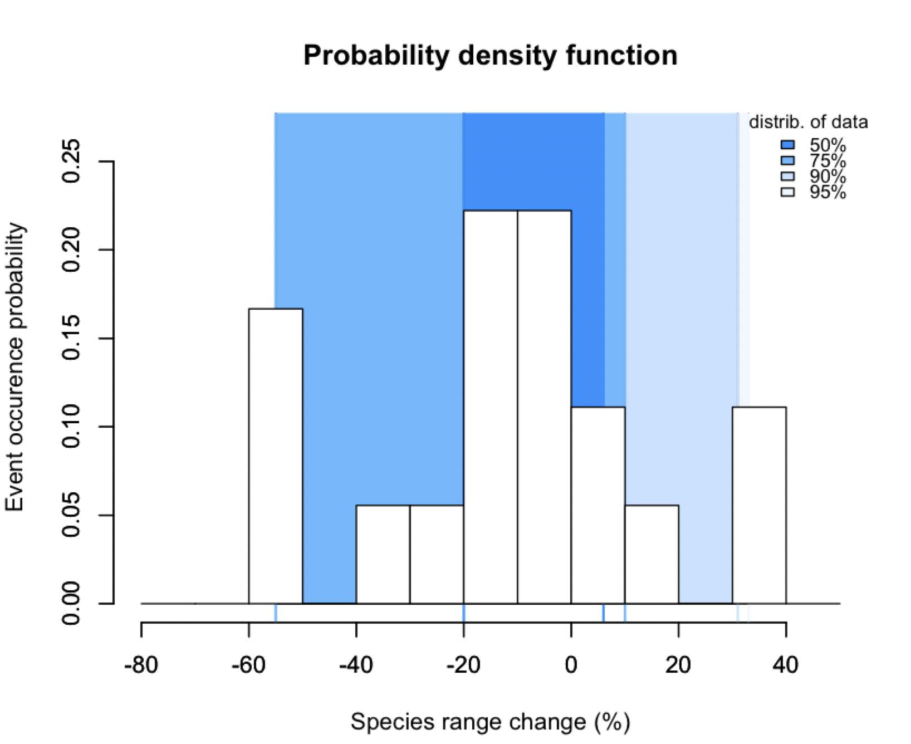
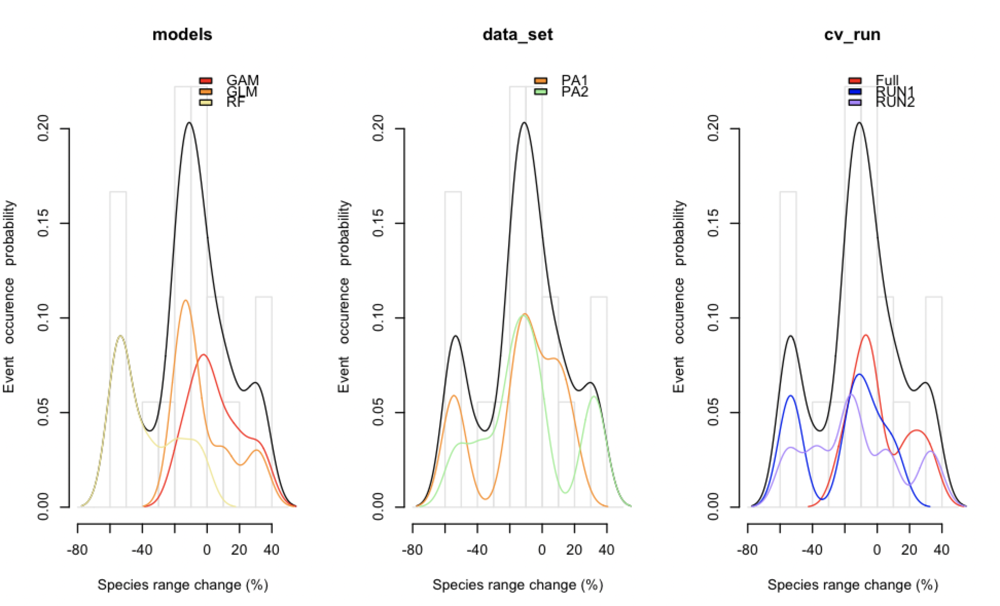
### 多变量模型拟合与预测
```r
## setup environment ----
setwd('workdir')

## load the required packages
library(biomod2)
library(raster)
library(rasterVis)
library(gridExtra)
library(reshape2)

## read data ----
## species occurences data
data <- read.csv('../data/Larus_occ.csv', stringsAsFactors = FALSE)
head(data)
table(data$species)
spp_to_model <- unique(data$species)

## curent climatic variables
stk_current <- 
  raster::stack(
    c(
      bio_1 =  "../data/worldclim_EU/worldclim_EU_bio_1.tif",
      bio_12 = "../data/worldclim_EU/worldclim_EU_bio_12.tif",
      bio_8 =  "../data/worldclim_EU/worldclim_EU_bio_8.tif"
    ),
    RAT = FALSE
  )

## 2050 climatic variables
stk_2050_BC_45 <- 
  raster::stack(
    c(
      bio_1 =  "../data/worldclim_EU/worldclim_EU_2050_BC45_bio_1.tif",
      bio_12 = "../data/worldclim_EU/worldclim_EU_2050_BC45_bio_12.tif",
      bio_8 =  "../data/worldclim_EU/worldclim_EU_2050_BC45_bio_8.tif"
    ),
    RAT = FALSE
  )

## 2070 climatic variables
stk_2070_BC_45 <- 
  raster::stack(
    c(
      bio_1 =  "../data/worldclim_EU/worldclim_EU_2070_BC45_bio_1.tif",
      bio_12 = "../data/worldclim_EU/worldclim_EU_2070_BC45_bio_12.tif",
      bio_8 =  "../data/worldclim_EU/worldclim_EU_2070_BC45_bio_8.tif"
    ),
    RAT = FALSE
  )


## build species modelling wrapper ----
biomod2_wrapper <- function(sp){
  cat("\n> species : ", sp)
  
  ## get occurrences points
  sp_dat <- data[data$species == sp, ]
  
  ## formating the data
  sp_format <- 
    BIOMOD_FormatingData(
      resp.var = rep(1, nrow(sp_dat)), 
      expl.var = stk_current,
      resp.xy = sp_dat[, c("long", "lat")],
      resp.name = sp,
      PA.strategy = "random", 
      PA.nb.rep = 2, 
      PA.nb.absences = 1000
    )
  
  ## print formatting summary
  sp_format
  
  ## save image of input data summary
  if(!exists(sp)) dir.create(sp)
  pdf(paste(sp, "/", sp ,"_data_formated.pdf", sep="" ))
  try(plot(sp_format))
  dev.off()
  
  ## define models options
  sp_opt <- BIOMOD_ModelingOptions()
  
  ## model species
  sp_model <- BIOMOD_Modeling( 
    sp_format, 
    models = c('GLM', 'FDA', 'RF'), 
    models.options = sp_opt, 
    NbRunEval = 2, 
    DataSplit = 70, 
    Yweights = NULL, 
    VarImport = 3, 
    models.eval.meth = c('TSS', 'ROC'),
    SaveObj = TRUE,
    rescal.all.models = FALSE,
    do.full.models = FALSE,
    modeling.id = "demo2"
  )
  
  ## save some graphical outputs
  #### models scores
  pdf(paste0(sp, "/", sp , "_models_scores.pdf"))
  try(gg1 <- models_scores_graph(sp_model, metrics = c("TSS", "ROC"), by = 'models', plot = FALSE))
  try(gg2 <- models_scores_graph(sp_model, metrics = c("TSS", "ROC"), by = 'data_set', plot = FALSE))
  try(gg3 <- models_scores_graph(sp_model, metrics = c("TSS", "ROC"), by = 'cv_run', plot = FALSE))
  try(grid.arrange(gg1, gg2, gg3))
  dev.off()
  
  ## build ensemble models
  sp_ens_model <- 
    BIOMOD_EnsembleModeling(
      modeling.output = sp_model,
      em.by = 'all',
      eval.metric = 'TSS',
      eval.metric.quality.threshold = 0.4,
      models.eval.meth = c('TSS','ROC'),
      prob.mean = FALSE,
      prob.mean.weight = TRUE,
      VarImport = 0
    )
  
  ## do projections
  proj_scen <- c("current", "2050_BC_45", "2070_BC_45")
  
  for(scen in proj_scen){
    cat("\n> projections of ", scen)
    
    ## single model projections
    sp_proj <- 
      BIOMOD_Projection(
        modeling.output = sp_model,
        new.env = get(paste0("stk_", scen)),
        proj.name = scen,
        selected.models = 'all',
        binary.meth = "TSS",
        filtered.meth = NULL,
        compress = TRUE,
        build.clamping.mask = FALSE,
        do.stack = FALSE,
        output.format = ".img"
      )
    
    ## ensemble model projections
    sp_ens_proj <- 
      BIOMOD_EnsembleForecasting(
        EM.output = sp_ens_model,
        projection.output = sp_proj,
        binary.meth = "TSS",
        compress = TRUE,
        do.stack = FALSE,
        output.format = ".img"
      )
  }
  
  return(paste0(sp," modelling completed !"))
}


## launch the spiecies modelling wrapper over species list ----
if(require(snowfall)){ ## parallel computation
  ## start the cluster
  sfInit(parallel = TRUE, cpus = 5) ## here we only require 4 cpus
  sfExportAll()
  sfLibrary(biomod2)
  ## launch our wrapper in parallel
  sf_out <- sfLapply(spp_to_model, biomod2_wrapper)
  ## stop the cluster
  sfStop()
} else { ## sequencial computation
  for (sp in spp_to_model){
    biomod2_wrapper(sp)
  }
  ## or with a lapply function in sequential model
  ## all_species_bm <- lapply(spp_to_model, biomod2_wrapper)
}

## produce alpha-diversity maps ----

## current conditons
### load binary projections
f_em_wmean_bin_current <- 
  paste0(
    spp_to_model,
    "/proj_current/individual_projections/", 
    spp_to_model, "_EMwmeanByTSS_mergedAlgo_mergedRun_mergedData_TSSbin.img"
  )

### sum all projections
if(length(f_em_wmean_bin_current) >= 2){
  ## initialisation
  taxo_alpha_div_current <- raster(f_em_wmean_bin_current[1]) 
  for(f in f_em_wmean_bin_current[-1]){
    taxo_alpha_div_current <- taxo_alpha_div_current + raster(f)
  }
}

## 2050 conditons
### load binaries projections
f_em_wmean_bin_2050 <- 
  paste0(
    spp_to_model,
    "/proj_2050_BC_45/individual_projections/", 
    spp_to_model, "_EMwmeanByTSS_mergedAlgo_mergedRun_mergedData_TSSbin.img"
  )

### sum all projections
if(length(f_em_wmean_bin_2050) >= 2){
  ## initialisation
  taxo_alpha_div_2050 <- raster(f_em_wmean_bin_2050[1]) 
  for(f in f_em_wmean_bin_2050[-1]){
    taxo_alpha_div_2050 <- taxo_alpha_div_2050 + raster(f)
  }
}

## 2070 conditons
### load binaries projections
f_em_wmean_bin_2070 <- 
  paste0(
    spp_to_model,
    "/proj_2070_BC_45//individual_projections/", 
    spp_to_model, "_EMwmeanByTSS_mergedAlgo_mergedRun_mergedData_TSSbin.img"
  )

### sum all projections
if(length(f_em_wmean_bin_2070) >= 2){
  ## initialisation
  taxo_alpha_div_2070 <- raster(f_em_wmean_bin_2070[1]) 
  for(f in f_em_wmean_bin_2070){
    taxo_alpha_div_2070 <- taxo_alpha_div_2070 + raster(f)
  }
}

## plot the alpha-div maps
levelplot(
  stack(
    c(
      current = taxo_alpha_div_current, 
      in_2050 = taxo_alpha_div_2050, 
      in_2070 = taxo_alpha_div_2070 
    )
  ),
  main = expression(paste("Larus ", alpha, "-diversity")),
  par.settings = BuRdTheme
)
```
## 物种迁徙模型:KissMig
### KissMig功能与组成
KissMig意思就是“Keep it simple species migration model”，这是一个简单的基于栅格图像的物种迁移模型，它可以非常简单快速地模拟物种的迁移。

#### kissmig( )
kissmig运行一个简单的、基于栅格的随机迁移模型来模拟物种迁移和范围转移。它使用地理区域的起源和适宜性地图迭代运行一个简单的3x3单元算法。特别是，它允许生成可访问性地图，以便在物种分布模型中轻松整合有限的迁移。

```r
kissmig(O, S = NULL, it, type = 'FOC', signed = FALSE, pext = 1.0, pcor = 0.2, seed = NULL)
```

其中：
`O`为地理起源的单一栅格图像；
`S`为适宜性图像，可以是单一的栅格，也可以是堆栈的栅格图像，或者是别的什么；
`it`为迭代的次数；
`type`为输出结果的类型，`‘DIS’`为最终的分布图，`'FOC'`是迭代至第一次出现的情景，`'LOC'`是迭代至最后一次出现时的情景，`'NOC'`是出现的迭代次数；
`signed`如果为`TRUE`，则符号指示单元在最后的迭代步骤后是定植(+)还是非定植(-)；
`pext`在0与1之间，一个定殖细胞在迭代步骤之间变为非定殖，则物种局部灭绝；
`pcor`在0与1之间，在3x3单元邻域中考虑对角的单元；
`seed`用于设置随机数生成器种子的整数。

从最初的`O`开始，kissmig在由适合性层特征的异类环境中模拟`it`迭代步骤的迁移`S`。原点`O`的定植单元值为1，未定植细胞值为0。如果“S”包含几个适合性层以覆盖环境变化，则`it`应用于每一层。适宜性在0(不合适)和1(适宜性最大)之间。kissmig使用3x3算法进行物种传播/迁移。所有的细胞在以`pext`为概率的迭代步骤前都得到扩增，对于一个再克隆或新的定植事件，3x3邻域内的对角单元以`pcor`为概率考虑(`pcor=0.2`产生更真实的循环扩散模式——参见Nobis & Normand 2014)。对于运行时优化，`signed=TRUE`会生成带符号的结果，也就是说，在结果类型“FOC”、“LCO”或“NOC”的基础上，符号表示最终的分布(`'DIS'`)，其中正的值是已定植的，负的值是已定植但在最后一步迭代后未殖民化的。为了得到可重复的结果，可以使用“seed”参数设置R随机数生成器的种子。

#### kissmigAccess( )
从kissmig中获取可访问的地图，kissmigAccess从第一次出现的kissmig输出计算可访问性映射(type = 'FOC')。这些地图允许在物种分布模型和宏观生态分析中整合有限的迁移。

```r
kissmigAccess(grd, rel=FALSE)
```

`grd`是由kissmig成的第一次出现的单个光栅层
`rel`如果为`TRUE`，kissmigAccess返回最大值为1的相对值，否则返回绝对积分值。

第一次出现的kissmig映射显示栅格单元的第一个迭代步骤的值。早期定殖细胞值低，晚期定殖细胞值高。这些值与可及性正好相反，可及性在早期定植的单元中较高，在晚期定植的单元中较低。`kissmigAccess`只是将每个单元格的可访问性计算为单元格值与max(grd)+1之间的差值。从未被定植的单元保持不变(值为0)。

### KissMig的使用
```r
#  Michael Nobis/WSL (michael.nobis@wsl.ch), December 2014
  library(kissmig)  # loads also raster package as dependency
# 生成/下载一些地图以供以后使用
  ## 得到有着年平均正态分布的适宜性图
  ## 基于worldclim的气温图
  s <- kissmigDummyS(mean=12,sd=3, download=TRUE)
  ## 并绘制出来
  plot(s, asp=1.0, main='simple climate suitability map')

  ## 定义一个起源
  o <- kissmigOrigin(s, 8, 44.5, 0.5)
  plot(o  , asp=1.0, main='origin')
  plot(s+o, asp=1.0, main='suitability + origin')

  ## 定义土地掩膜
  landMask <- s>=0
  plot(landMask, asp=1.0, main='land mask')
```
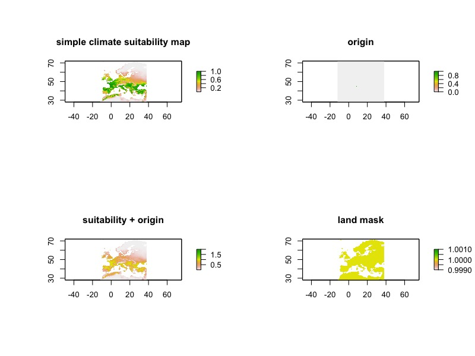
```r
# 运行kissmig并输出各种东西

  k <- kissmig(o, s, it=150, type='DIS')
  plot(k*landMask, asp=1.0, main='final distribution')

  k <- kissmig(o, s, it=150, type='FOC')
  plot(k*landMask, asp=1.0, main='first iteration step of occurrence')

  a <- kissmigAccess(k)
  plot(a*landMask, asp=1.0, main='accessibility based on "FOC", absolute values')

  a <- kissmigAccess(k, rel=TRUE)
  plot(a*landMask, asp=1.0, main='accessibility based on "FOC", relative values')

  k <- kissmig(o, s, it=150, type='LOC')
  plot(k*landMask, asp=1.0, main='last iteration step of occurrence')
  
  k <- kissmig(o, s, it=150, type='NOC')
  plot(k*landMask, asp=1.0, main='number of iteration steps with occurrences')

# 通过设置随机数生成器的种子来控制随机性

  ## 带有随机差异的两次运行
  k1 <- kissmig(o, s, it=150, type='DIS') # two final distributions with
  k2 <- kissmig(o, s, it=150, type='DIS') # same origin and suitability map
  plot(k1*landMask, asp=1.0, main='final distribution - no seed set - run1')
  plot(k2*landMask, asp=1.0, main='final distribution - no seed set - run2')
  plot(abs(k1-k2)*landMask, asp=1.0, main='differences between run1 and run2')

  ## 无随机差异的两次运行
  k1 <- kissmig(o, s, it=150, type='DIS', seed=123)
  k2 <- kissmig(o, s, it=150, type='DIS', seed=123)
  plot(k1*landMask, asp=1.0, main='final distribution - seed set - run1')
  plot(k2*landMask, asp=1.0, main='final distribution - same seed set - run2')
  plot(abs(k1-k2)*landMask, asp=1.0, main='stochastic differences between run1 and run2')

# 创建一个“签名”结果;符号返回最终的分布'DIS'
# creating a "signed" result; the sign returns the final distribution 'DIS' 
# 如果与“FOC”、“LOC”或“NOC”组合;用于运行时优化
# if combined with 'FOC', 'LOC', or 'NOC'; useful for runtime optimization

  k <- kissmig(o, s, it=200, type='FOC', signed=TRUE)
  plot(    k   *landMask, asp=1.0, main='signed "FOC" call, raw output')

  ## abs(k): same as type='FOC' and signed=FALSE
  plot(abs(k  )*landMask, asp=1.0, main='signed "FOC" call, absolute values')

  ## extract information of final distribution 'DIS'
  plot(abs(k>0)*landMask, asp=1.0, main='signed "FOC" call, values > 0')

  ## extract cells with 'FOC' information but no final occurrences
  plot(abs(k<0)*landMask, asp=1.0, main='signed "FOC" call, values < 0')

# --------------------------------------------------------------------------
# 使用kissmig对许多适宜性地图进行运算; 对观察变化很有用 
# 物种传播或繁殖期间的环境

  ## 单一适宜性地图显示气候变暖
  s1 <- kissmigDummyS(mean=12,sd=3) # 
  s2 <- kissmigDummyS(mean=11,sd=3) # 模拟一种气候变暖的适宜性s1
  s3 <- kissmigDummyS(mean=10,sd=3) # 模拟一种气候变暖的适宜性s2

  ## 构建具有或不具有适应性变化的堆栈数据
  s111 <- stack(s1,s1,s1) # or brick(s1,s1,s1)
  s123 <- stack(s1,s2,s3) # or brick(s1,s2,s3)

  ## 运行kissmig，无论环境是否改变
  k111 <- kissmig(o, s111, it=50, type='NOC', seed=123) # 3层=150次迭代
  k123 <- kissmig(o, s123, it=50, type='NOC', seed=123) #总步骤

  ## kissmig results
  plot(k111*landMask, asp=1.0, main='3 suitability layers, 50 it./layer, no env. changes')
  plot(k123*landMask, asp=1.0, main='3 suitability layers, 50 it./layer, climate warming')

  ## 在传播过程中随着气候变暖而变化
  gain <- (k123 >0) * (k111==0)
  same <- (k123 >0) * (k111 >0)
  loss <- (k123==0) * (k111 >0)
  plot((loss+(2*same)+(3*gain))*landMask, 
    col=colorRampPalette(c(grey(0.9),"red",grey(0.6),"green"))(4), asp=1.0, 
    main='differences between spread patterns under climate warming', legend=FALSE)
  legend("topleft", legend=c('gain', 'no change', 'loss'), pch=15, col=c('green', grey(0.6), 'red') )
```
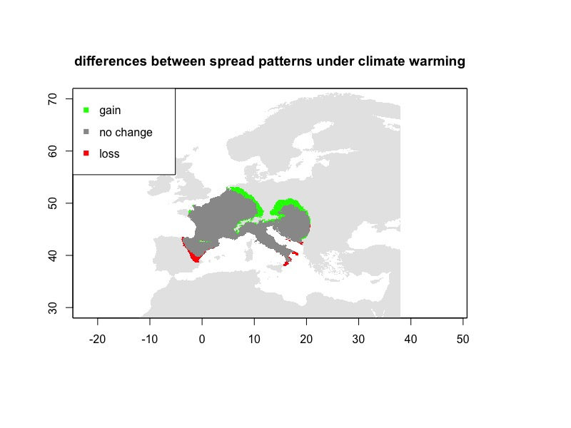
```r
# 探索地理空间
# example: 传播模式的大小=100:来自不同起源
# remark: 运行得慢主要是因为绘制地图较慢

  # 适宜性图和结果图
  par(mfrow=c(1,1))
  s <- kissmigDummyS(mean=14,sd=3)
  plot(s, asp=1.0, main='simple climate suitability map')
  res <- s>9999 # a map to store results

  # 探索空间
  par(mfrow=c(2,1))
  for (y in (15:17)*2.5) {
    for (x in (-4:11)*2.5) {
      
      # 定义起源并运行kissmig
      o <- kissmigOrigin(s, x, y, 2.5)
      k <- kissmig(o, s, type='FOC', it=100)
      
      # 保存扩散模式的大小(定植细胞的数量)  
      # 在单元格或结果映射(res)的原始数据(origin)中
      values(res)[values(o)==1] <- sum(values(k)>0)

      # 除了面积，这里可以添加任何评估过程，例如SDM框架中的可访问性性能
      
      # 传播模式与结果图
      plot(k*landMask, asp=1.0, main='spread pattern from single region')
      plot(res*landMask, asp=1.0, main='size of spread pattern (number of colonized cells)')
      
    }
  }

# EOF - end of file
```