### 基于R语言的冗余分析与方差分解

# 基于R的冗余分析（RDA）与方差分解（VPA）
- [基于R的冗余分析（RDA）与方差分解（VPA）](#基于r的冗余分析rda与方差分解vpa)
  - [冗余分析](#冗余分析)
    - [数据准备](#数据准备)
      - [准备遗传学数据](#准备遗传学数据)
      - [准备空间数据](#准备空间数据)
      - [准备环境数据](#准备环境数据)
    - [进行冗余分析](#进行冗余分析)
    - [Model summaries](#model-summaries)
    - [RDA的可视化](#rda的可视化)
    - [部分冗余分析](#部分冗余分析)
  - [方差分解](#方差分解)
    - [简单的方差分解步骤](#简单的方差分解步骤)
    - [全流程方差分解](#全流程方差分解)
    - [多因子方差分解](#多因子方差分解)
## 冗余分析
本教程使用了在Evolutionary Applications[(Jenkins et al.，2019)](https://onlinelibrary.wiley.com/doi/full/10.1111/eva.12849)上发表的欧洲龙虾（Homarus gammarus）种群遗传学研究中的双等位基因SNP基因型数据，数据可通过以下链接[下载](https://doi.org/10.5061/dryad.2v1kr38)
原版教程来自[Tom-Jenkins](https://github.com/Tom-Jenkins/seascape_rda_tutorial)
本教程使用的相关R环境的下载可以前往[我的github](https://github.com/Vendredii/Rstats/rda)
在使用本教材进行RDA实践操作及基于此利用RDA方法撰写论文时，请按如下格式引用[该文献](https://onlinelibrary.wiley.com/doi/full/10.1111/eva.12849)
Jenkins, T. L., Ellis, C. D., & Stevens, J. R. (2019). SNP discovery in European lobster (Homarus gammarus) using RAD sequencing. *Conservation Genetics Resources*, 11, 253– 257.
### 数据准备
#### 准备遗传学数据
加载相关R包与环境
```r
# adegenet包加载失败就把所有包更新一下，再重启一下
library(adegenet)
library(poppr)
library(tidyverse)
# setwd('/Users/calice/desktop/Rstats/rda')
load("lobster_1278ind_79snps_40pop.RData")
```
探索相关数据
```r
data_filt
nLoc(data_filt) # number of loci
nPop(data_filt) # number of sites
nInd(data_filt) # number of individuals
summary(data_filt$pop) # sample size
```
整理数据
```r
# 结合撒丁岛的时间样本
popNames(data_filt) = gsub("Sar13", "Sar", popNames(data_filt))
popNames(data_filt) = gsub("Sar17", "Sar", popNames(data_filt))
# 合并拉齐奥的样本
popNames(data_filt) = gsub("Tar", "Laz", popNames(data_filt))
# 合并Idr的时间样本
popNames(data_filt) = gsub("Idr16", "Idr", popNames(data_filt))
popNames(data_filt) = gsub("Idr17", "Idr", popNames(data_filt))
# 新数据
data_filt
nPop(data_filt) # number of sites
nInd(data_filt) # number of individuals
summary(data_filt$pop) # sample size
```
计算变量
```r
# 计算等位基因频率
allele_freqs = data.frame(rraf(
# 为每个地点计算等位基因频率
allele_freqs = data.frame(rraf(data_filt, by_pop=TRUE, correction = FALSE), check.names = FALSE)
# 每个SNP只保留两个等位基因中的第一个（p = 1-q）
allele_freqs = allele_freqs[, seq(1, dim(allele_freqs)[2], 2)]
# 导出
write.csv(allele_freqs, file = "allele_freqs.csv", row.names = TRUE)
# 计算次等位基因频率
# 按地点分离genind对象
site_list = seppop(data_filt)
names(site_list)
# 为每个地点计算次等位基因频率
maf_list = lapply(site_list, FUN = minorAllele)
# 将它们加入数据框
maf = as.data.frame(maf_list) %>% t() %>% as.data.frame()
head(maf)
# 导出
write.csv(maf, file = "minor_allele_freqs.csv", row.names = TRUE)
```
可视化等位基因频率
```r
# 添加地点记号
allele_freqs$site = rownames(allele_freqs)
# 在数据框中添加区域
addregion = function(x){
  # If pop label is present function will output the region
  if(x=="Ale"|x=="The"|x=="Tor"|x=="Sky") y = " Aegean Sea "
  if(x=="Sar"|x=="Laz") y = " Central Mediterranean "
  if(x=="Vig"|x=="Brd"|x=="Cro"|x=="Eye"|x=="Heb"|x=="Iom"|x=="Ios"|x=="Loo"|x=="Lyn"|x=="Ork"|x=="Pad"|x=="Pem"|x=="She"|x=="Sbs"|x=="Sul") y = " Atlantic "
  if(x=="Jer"|x=="Idr"|x=="Cor"|x=="Hoo"|x=="Kil"|x=="Mul"|x=="Ven") y = " Atlantic "
  if(x=="Hel"|x=="Oos"|x=="Tro"|x=="Ber"|x=="Flo"|x=="Sin"|x=="Gul"|x=="Kav"|x=="Lys") y = " Scandinavia "
  return(y)
}
# 增加区域记号
allele_freqs$region = sapply(rownames(allele_freqs), addregion)
# 将数据帧转换为长格式
allele_freqs.long = allele_freqs %>%
  pivot_longer(cols = 1:79, names_to = "allele", values_to = "frequency")
allele_freqs.long
# 使用factor中的levels参数定义地点的顺序
unique(allele_freqs.long$site)
site_order =  c("Tro","Ber","Flo","Gul","Kav","Lys","Sin","Hel","Oos",
                "Cro","Brd","Eye",
                "She","Ork","Heb","Sul","Cor","Hoo","Iom","Ios","Jer","Kil",
                "Loo","Lyn","Mul","Pad","Pem","Sbs","Ven",
                "Idr","Vig",
                "Sar","Laz","Ale","Sky","The","Tor")
allele_freqs.long$site_ord = factor(allele_freqs.long$site, levels = site_order)
# 定义区域顺序
region_order = c(" Scandinavia "," Atlantic "," Central Mediterranean ", " Aegean Sea ")
allele_freqs.long$region = factor(allele_freqs.long$region, levels = region_order)
# 创建配色方案
# blue=#377EB8, green=#7FC97F, orange=#FDB462, red=#E31A1C
col_scheme = c("#7FC97F","#377EB8","#FDB462","#E31A1C")
# SNP位点到子集的向量
desired_loci = c("7502","25608","31462","35584","42395","53314","58053","65064","65576")
desired_loci_ID = sapply(paste(desired_loci, "..", sep = ""),
                         grep,
                         unique(allele_freqs.long$allele),
                         value = TRUE) %>% as.vector()
# 绘制所需SNP位点的子集数据集
allele_freqs.sub = allele_freqs.long %>% filter(allele %in% desired_loci_ID)
# 设置ggplot2主题
ggtheme = theme(
  axis.text.x = element_blank(),
  axis.text.y = element_text(colour="black", size=6),
  axis.title = element_text(colour="black", size=15),
  panel.background = element_rect(fill="white"),
  panel.grid.minor = element_blank(),
  panel.grid.major = element_blank(),
  panel.border = element_rect(colour="black", fill=NA, size=0.5),
  plot.title = element_text(hjust = 0.5, size=18),
  legend.title = element_blank(),
  legend.text = element_text(size=15),
  legend.position = "top",
  legend.justification = "centre",
  # facet labels
  strip.text = element_text(colour="black", size=14)
)
# 绘制柱状图
ggplot(data = allele_freqs.sub, aes(x = site_ord, y = frequency, fill = region))+
  geom_bar(stat = "identity", colour = "black", size = 0.3)+
  facet_wrap(~allele, scales = "free")+
  scale_y_continuous(limits = c(0,1), expand = c(0,0))+
  scale_fill_manual(values = col_scheme)+
  ylab("Allele frequency")+
  xlab("Site")+
  ggtheme
# ggsave("allele_freq.png", width=10, height=8, dpi=600)
# ggsave("allele_freq.pdf", width=10, height=8)
```
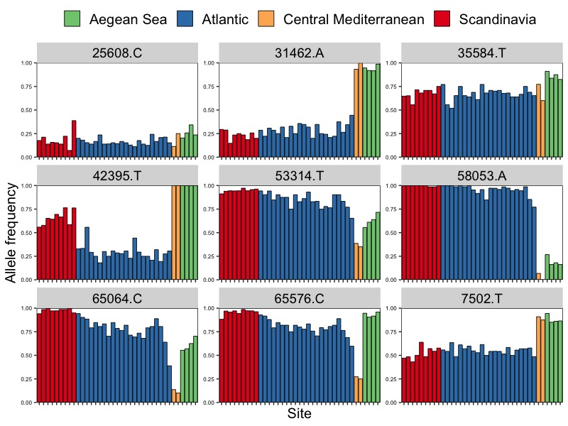
#### 准备空间数据
准备运行环境
```r
library(marmap)
library(tidyverse)
library(ade4)
library(adespatial)
library(SoDA)
```
```r
# 计算最小耗费距离
# 使用marmap软件包从NOAA获取水深数据
bathydata = getNOAA.bathy(lon1 = -15,
                          lon2 = 30,
                          lat1 = 35,
                          lat2 = 65,
                          resolution = 2)
# 输入各个采样区的坐标
coords = read.csv("coordinates.csv")
head(coords)
coords.gps = dplyr::select(coords, Lon, Lat)
# 获取坐标处的水深
depths = cbind(site = coords$Site, get.depth(bathydata, coords.gps, locator = FALSE))
depths
# 看看水深是否大于10m
depths$depth <= -10
# 绘制水深数据与坐标
plot(bathydata)
points(coords$Lon, coords$Lat, pch = 21, bg = "yellow", col = "black", cex = 2)
```
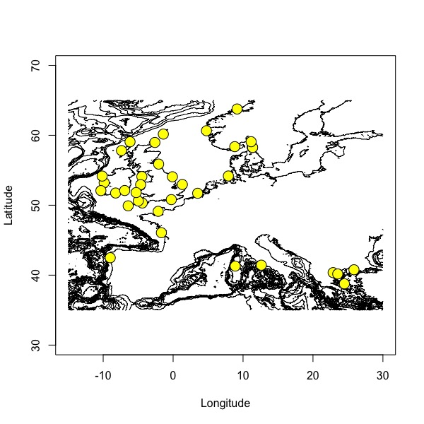

Tips:
marmap作者的推荐：
使用最小深度-10来避免路径穿过陆地块；使用最大深度-200来限制通往大陆架的路径
```r
# trans1 = trans.mat(bathydata, min.depth = -10, max.depth = NULL)
# save(trans1, file = "transition_object.RData")
# load("transition_object.RData")
# Compute least-cost paths [long run time]
# lc_paths = lc.dist(trans1, coords.gps, res = "path")
# save(lc_paths, file = "least_cost_paths.RData")
```
在地图上绘制距离（很慢）
```r
load("least_cost_paths.RData")
# 底图
plot.bathy(bathydata, image= TRUE, land = TRUE, n = 0,
           bpal = list(c(0, max(bathydata), "grey"),
                       c(min(bathydata), 0, "royalblue")))
# 轨迹
lapply(lc_paths, lines, col = "orange", lwd = 2, lty = 1)
```
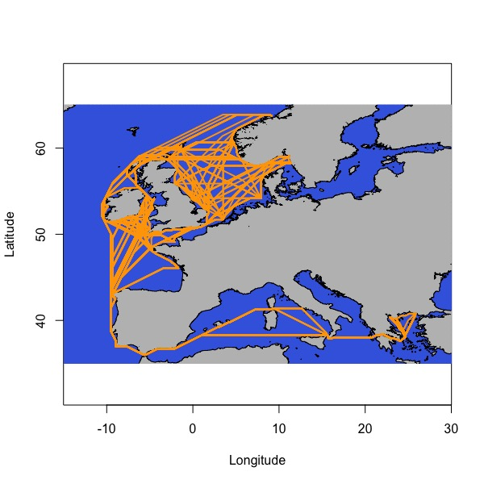
计算最小耗费距离矩阵
```r
lc_dist = lc.dist(trans1, coords.gps, res = "dist")
# 转换为矩阵，重命名列和行，并导出为csv文件
lc_mat = as.matrix(lc_dist)
colnames(lc_mat) = as.vector(coords$Site)
rownames(lc_mat) = as.vector(coords$Site)
lc_mat
# write.csv(lc_mat, file="lc_distances_km.csv")
```
计算基于距离的Moran特征向量映射（空间相关矩阵？
```r
# 查看学习资料
vignette("tutorial", package = "adespatial")
# 将地理坐标转换为笛卡尔坐标
# 计算欧几里得距离(km)
# cart = geoXY(coords$Lat, coords$Lon, unit = 1000)
# euclidian_distances = dist(cart, method = "euclidean") 
dbmems = dbmem(lc_dist, MEM.autocor = "non-null")
dbmems
# write.csv(dbmems, file = "dbmems.csv", row.names = FALSE)
```
#### 准备环境数据
数据如下：
平均海面温度(SST):当前(摄氏)
平均海底温度(SBT):当前(摄氏度)
平均海表盐度(SSS):当前(实际盐度标)
平均海底盐度(SBS):当前(实际盐度标)
平均海面叶绿素浓度(SSC):当前(mg/m3)
平均海面钙含量(SSCa):当前(mol/m3)
数据来源：http://www.bio-oracle.org
具体asc数据也可以发邮件找我要
加载环境
```r
library(raster)
library(dplyr)
# devtools::install_github("ropenscilabs/rnaturalearth")
# devtools::install_github("ropenscilabs/rnaturalearthdata")
# devtools::install_github("ropenscilabs/rnaturalearthhires")
library(rnaturalearth)
library(rnaturalearthdata)
library(rnaturalearthhires)
library(ggplot2)
library(RColorBrewer)
library(ggpubr)
```
加载数据
```r
sst.present = raster("Present.Surface.Temperature.Mean.asc")
sbt.present = raster("Present.Benthic.Max.Depth.Temperature.Mean.asc")
sss.present = raster("Present.Surface.Salinity.Mean.asc")
sbs.present = raster("Present.Benthic.Max.Depth.Salinity.Mean.asc")
ssc.present = raster("Present.Surface.Chlorophyll.Mean.asc")
ssca.present = raster("Present.Surface.Calcite.Mean.asc")
```
提取环境数据
```r
# 导入坐标
coords = read.csv("coordinates.csv")
names(coords)
# 用坐标创建空间点
points = SpatialPoints(subset(coords, select = c("Lon","Lat")))
# 利用坐标提取环境数据
df = data.frame(site = coords$Site,
                sst_mean = extract(sst.present, points),
                sbt_mean = extract(sbt.present, points),
                sss_mean = extract(sss.present, points),
                sbs_mean = extract(sbs.present, points),
                ssc_mean = extract(ssc.present, points),
                ssca_mean = extract(ssca.present, points)
)
# write.csv(df, file="environmental_data.csv", row.names = FALSE)
```
绘制热力图
```r
#设置图的边界 (xmin, xmax, ymin, ymax)
extent(points)
boundary = extent(-20, 30, 35, 65)
boundary
# 裁剪栅格到边界并转换成点的数据框
sst.df = crop(sst.present, y = boundary) %>% rasterToPoints() %>% data.frame()
sbt.df = crop(sbt.present, y = boundary) %>% rasterToPoints() %>% data.frame()
sss.df = crop(sss.present, y = boundary) %>% rasterToPoints() %>% data.frame()
sbs.df = crop(sbs.present, y = boundary) %>% rasterToPoints() %>% data.frame()
ssc.df = crop(ssc.present, y = boundary) %>% rasterToPoints() %>% data.frame()
ssca.df = crop(ssca.present, y = boundary) %>% rasterToPoints() %>% data.frame()
# 加载基础底图
basemap = ne_countries(scale = "large")
# 裁剪到边界并转换为数据框
basemap = crop(basemap, y = boundary) %>% fortify()
```
准备ggplot主题
```r
# 准备ggplot主题
ggtheme = theme(axis.title = element_text(size = 12),
                axis.text = element_text(size = 10, colour = "black"),
                panel.border = element_rect(fill = NA, colour = "black", size = 0.5),
                legend.title = element_text(size = 13),
                legend.text = element_text(size = 12),
                plot.title = element_text(size = 15, hjust = 0.5),
                panel.grid = element_blank())
# 准备颜色
temp.cols = colorRampPalette(c("blue","white","red"))
sal.cols = colorRampPalette(c("darkred","white"))
chlor.cols = colorRampPalette(c("white","green"))
calct.cols = colorRampPalette(c("white","#662506"))
```
绘制海洋表明温度
```r
sst.plt = ggplot()+
  geom_tile(data = sst.df, aes(x = x, y = y, fill = sst.df[, 3]))+
  geom_polygon(data = basemap, aes(x = long, y = lat, group = group))+
  coord_quickmap(expand = F)+
  xlab("Longitude")+
  ylab("Latitude")+
  ggtitle("Sea surface temperature (present-day)")+
  scale_fill_gradientn(expression(~degree~C), colours = temp.cols(10), limits = c(-1.5,24))+
  ggtheme
sst.plt
ggsave("1.sst_heatmap.png", width = 10, height = 9, dpi = 600)
# ggsave("Rplot15.png", width = 10, height = 9, dpi = 300)
```
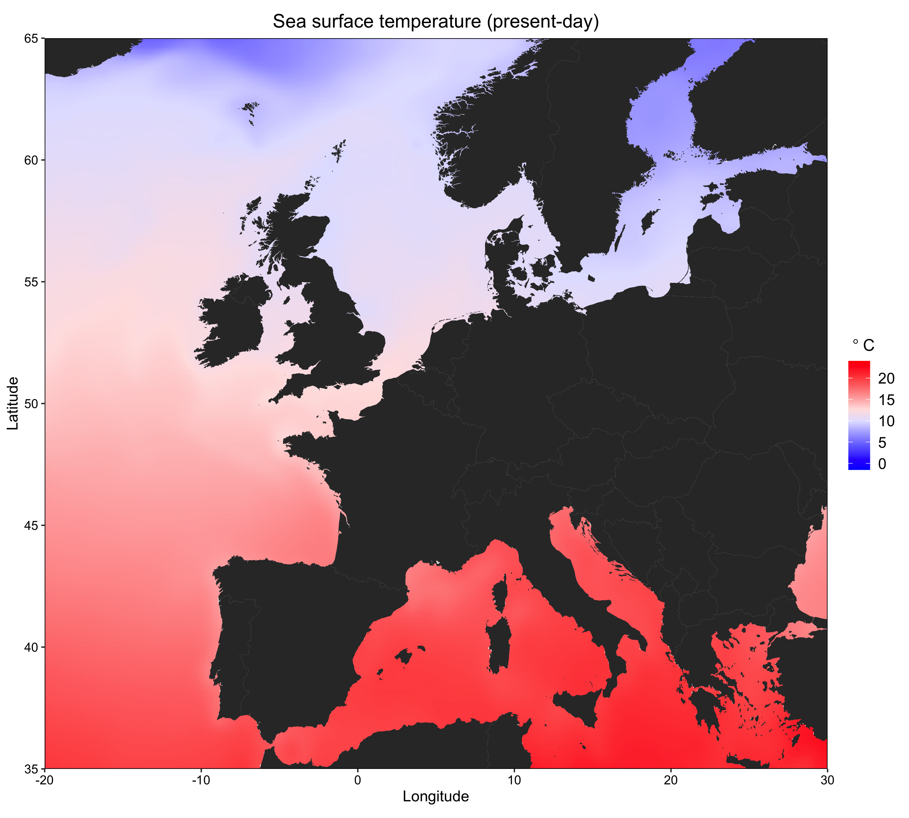
绘制海底温度
```r
sbt.plt = ggplot()+
  geom_tile(data = sbt.df, aes(x = x, y = y, fill = sbt.df[, 3]))+
  geom_polygon(data = basemap, aes(x = long, y = lat, group = group))+
  coord_quickmap(expand = F)+
  xlab("Longitude")+
  ylab("Latitude")+
  ggtitle("Sea bottom temperature (present-day)")+
  scale_fill_gradientn(expression(~degree~C), colours = temp.cols(10), limits = c(-1.5,24))+
  ggtheme
sbt.plt
ggsave("2.sbt_heatmap.png", width = 10, height = 9, dpi = 600)
```
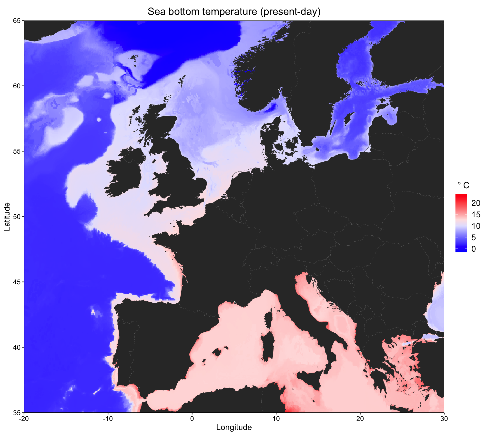
绘制海面盐度
```r
sss.plt = ggplot()+
  geom_tile(data = sss.df, aes(x = x, y = y, fill = sss.df[, 3]))+
  geom_polygon(data = basemap, aes(x = long, y = lat, group = group))+
  coord_quickmap(expand = F)+
  xlab("Longitude")+
  ylab("Latitude")+
  ggtitle("Sea surface salinity (present-day)")+
  scale_fill_gradientn("PPS", colours = sal.cols(10), limits = c(1,40))+
  ggtheme
sss.plt
ggsave("3.sss_heatmap.png", width = 10, height = 9, dpi = 600)
```
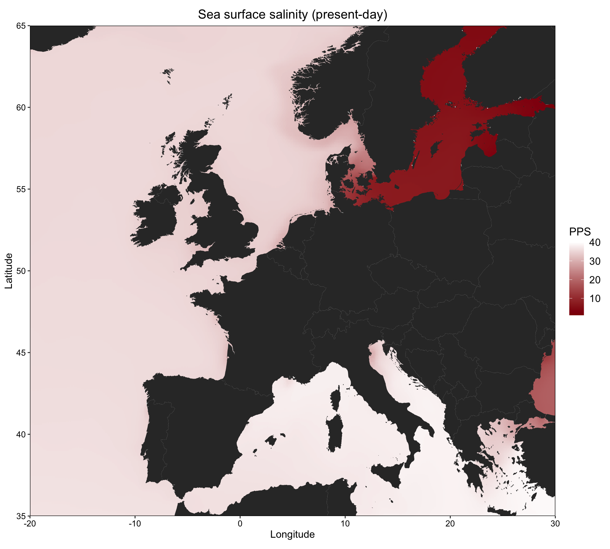
绘制海底盐度
```r
sbs.plt = ggplot()+
  geom_tile(data = sbs.df, aes(x = x, y = y, fill = sbs.df[, 3]))+
  geom_polygon(data = basemap, aes(x = long, y = lat, group = group))+
  coord_quickmap(expand = F)+
  xlab("Longitude")+
  ylab("Latitude")+
  ggtitle("Sea bottom salinity (present-day)")+
  scale_fill_gradientn("PPS", colours = sal.cols(10), limits = c(1,40))+
  ggtheme
sbs.plt
ggsave("4.sbs_heatmap.png", width = 10, height = 9, dpi = 600)
```
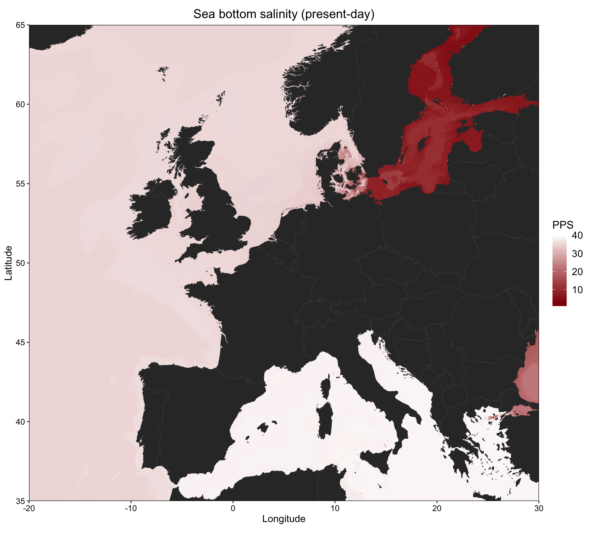
绘制海面叶绿体浓度
```r
ssc.plt = ggplot()+
  geom_tile(data = ssc.df, aes(x = x, y = y, fill = ssc.df[, 3]))+
  geom_polygon(data = basemap, aes(x = long, y = lat, group = group))+
  coord_quickmap(expand = F)+
  xlab("Longitude")+
  ylab("Latitude")+
  ggtitle("Sea surface chlorophyll (present-day)")+
  scale_fill_gradientn(expression(paste("mg/m"^"3")), colours = chlor.cols(10))+
  ggtheme
ssc.plt
ggsave("5.ssc_heatmap.png", width = 10, height = 9, dpi = 600)
```
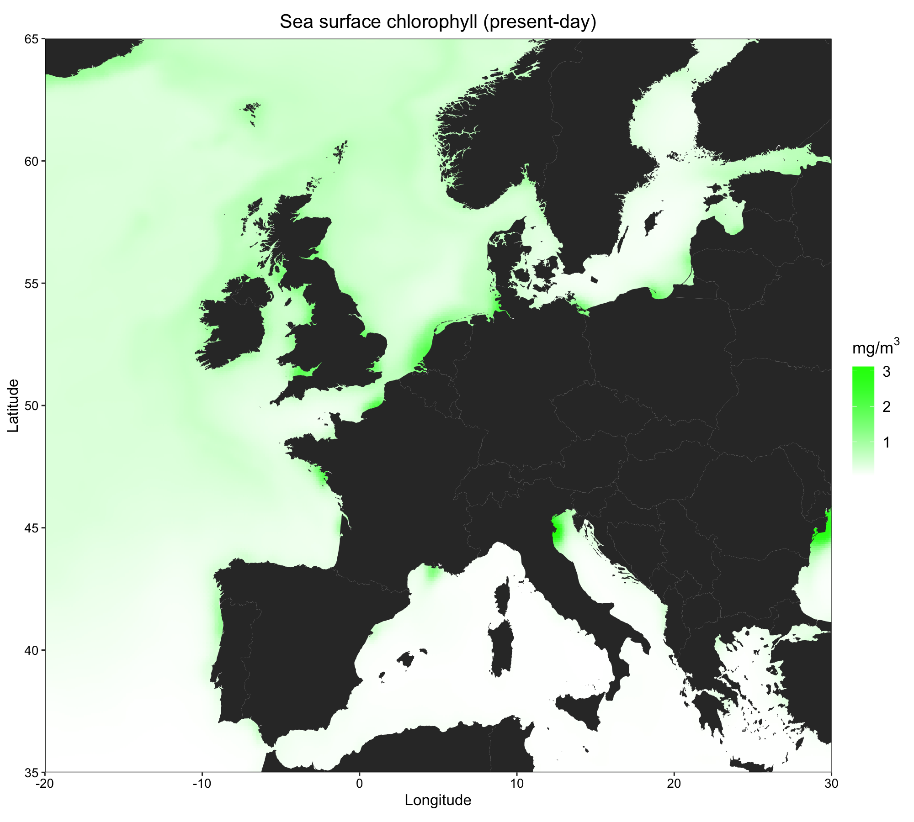
绘制海面钙含量
```r
ssca.plt = ggplot()+
  geom_tile(data = ssca.df, aes(x = x, y = y, fill = ssca.df[, 3]))+
  geom_polygon(data = basemap, aes(x = long, y = lat, group = group))+
  coord_quickmap(expand = F)+
  xlab("Longitude")+
  ylab("Latitude")+
  ggtitle("Sea surface calcite (present-day)")+
  scale_fill_gradientn(expression(paste("mol/m"^"3")), colours = calct.cols(10))+
  ggtheme
ssca.plt
ggsave("6.ssca_heatmap.png", width = 10, height = 9, dpi = 600)
```
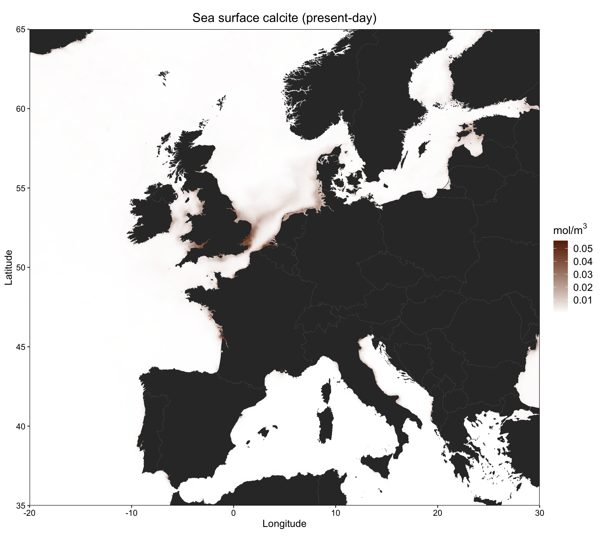
组合图片
```r
# 组合两张关于温度的
figAB = ggarrange(sst.plt + labs(tag = "A") + ggtheme + theme(axis.title.y = element_blank()),
                  sbt.plt + labs(tag = "B") + ggtheme + theme(axis.title.y = element_blank()),
                  ncol = 2, common.legend = TRUE, legend = "right")
figAB = annotate_figure(figAB,
                        left = text_grob("Latitude", size = 12, rot = 90))

# 组合两张关于盐分的
figCD = ggarrange(sss.plt + labs(tag = "C") + ggtheme + theme(axis.title.y = element_blank()),
                  sbs.plt + labs(tag = "D") + ggtheme + theme(axis.title.y = element_blank()),
                  ncol = 2, common.legend = TRUE, legend = "right")
figCD = annotate_figure(figCD,
                        left = text_grob("Latitude", size = 12, rot = 90))

# 把他们加起来
fig = ggarrange(figAB, figCD, nrow = 2)
ggsave("7.temp_sal_heatmap.png", width = 10, height = 10, dpi = 600)
# ggsave("7.temp_sal_heatmap.pdf", width = 10, height = 10)
```
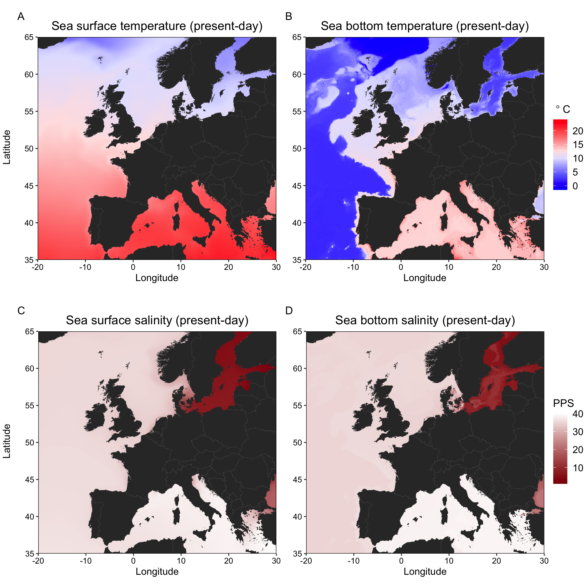
### 进行冗余分析
加载环境与数据
```r
library(tidyverse)
library(psych)
library(adespatial)
library(vegan)
# 加载基因数据
allele_freqs = read.csv("allele_freqs.csv", row.names = 1, check.names = FALSE)
# 加载空间数据
dbmem.raw = read.csv("dbmems.csv")
# 加载环境数据
env.raw = read.csv("environmental_data.csv", row.names = 1)
# 加载随机种子
set.seed(123)
```
多重共线性检验
```r
# 对环境变量进行相关检验
pairs.panels(env.raw, scale = TRUE)
# 移除相关性强的变量
env.data = subset(env.raw, select = -c(sst_mean, sbs_mean))
pairs.panels(env.data, scale = TRUE)
```
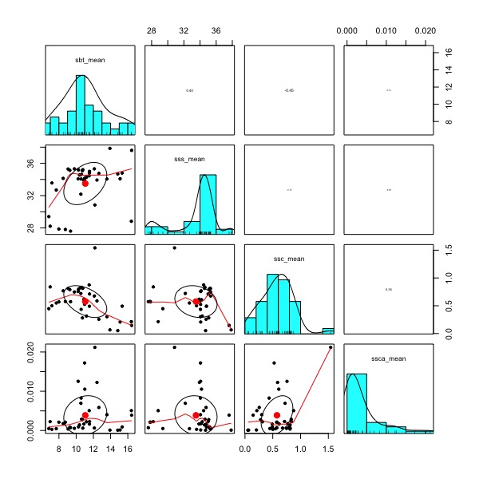
识别重要变量
```r
# 使用前向选择来确定重要的环境变量
env.for = forward.sel(Y = allele_freqs, X = env.data, alpha = 0.01)
env.for
#  variables order         R2     R2Cum  AdjR2Cum         F pvalue
# 1  sbt_mean     1 0.31150411 0.3115041 0.2918328 15.835453  0.001
# 2  sss_mean     2 0.09469125 0.4061954 0.3712657  5.421821  0.001
# 3 ssca_mean     4 0.07470387 0.4808992 0.4337083  4.749035  0.005
# 使用前向选择来确定重要的dbmems
dbmem.for = forward.sel(Y = allele_freqs, X = dbmem.raw, alpha = 0.01)
dbmem.for
#   variables order         R2     R2Cum  AdjR2Cum         F pvalue
# 1      MEM1     1 0.51661196 0.5166120 0.5028009 37.405598  0.001
# 2      MEM2     2 0.08518943 0.6018014 0.5783780  7.273860  0.001
# 3      MEM5     5 0.08000465 0.6818060 0.6528793  8.297309  0.001
# 4      MEM3     3 0.04720013 0.7290062 0.6951319  5.573574  0.001
# 5      MEM6     6 0.02189658 0.7509028 0.7107258  2.725016  0.010
```
我们只将重要的自变量子集包含在RDA中
```r
env.sig = subset(env.data, select = env.for$variables)
str(env.sig)
dbmem.sig = subset(dbmem.raw, select = dbmem.for$variables)
str(dbmem.sig)
# 组合这些变量
env.dbmems = cbind(env.sig, dbmem.sig)
str(env.dbmems)
```
进行冗余分析
```r
# 为所有变量进行冗余分析
rda1 = rda(allele_freqs ~ ., data = env.dbmems, scale = TRUE)
rda1
# Call: rda(formula = allele_freqs ~ sbt_mean + sss_mean +
# ssca_mean + MEM1 + MEM2 + MEM5 + MEM3 + MEM6, data = env.dbmems,
# scale = TRUE)

#               Inertia Proportion Rank
# Total         79.0000     1.0000     
# Constrained   44.9918     0.5695    8
# Unconstrained 34.0082     0.4305   28
# Inertia is correlations 

# Eigenvalues for constrained axes:
#   RDA1   RDA2   RDA3   RDA4   RDA5   RDA6   RDA7   RDA8 
# 22.319 10.537  3.837  2.995  2.540  1.194  0.966  0.604 

# Eigenvalues for unconstrained axes:
#   PC1   PC2   PC3   PC4   PC5   PC6   PC7   PC8 
# 4.940 3.197 2.488 2.400 2.121 1.732 1.655 1.617 
# (Showing 8 of 28 unconstrained eigenvalues)
```
### Model summaries
adjusted Rsquared 
```r
RsquareAdj(rda1)
# $r.squared
# [1] 0.5695167
# $adj.r.squared
# [1] 0.4465215
```
方差膨胀因子
```r
# variance inflation factor (<10 OK)
vif.cca(rda1)
```
全模型
```r
anova.cca(rda1, permutations = 1000)
# sbt_mean  sss_mean ssca_mean      MEM1      MEM2      MEM5      MEM3 
#  8.590561  1.791776  1.979065  7.012236  2.107733  1.105811  2.055020 
#      MEM6 
#  1.078194 
```
每个变量
```r
anova.cca(rda1, permutations = 1000, by="margin")
# Permutation test for rda under reduced model
# Marginal effects of terms
# Permutation: free
# Number of permutations: 1000

# Model: rda(formula = allele_freqs ~ sbt_mean + sss_mean + ssca_mean + MEM1 + MEM2 + MEM5 + MEM3 + MEM6, data = env.dbmems, scale = TRUE)
#           Df Variance      F   Pr(>F)    
# sbt_mean   1    0.913 0.7513 0.662338    
# sss_mean   1    1.868 1.5381 0.125874    
# ssca_mean  1    1.948 1.6040 0.082917 .  
# MEM1       1    4.059 3.3418 0.001998 ** 
# MEM2       1    1.771 1.4579 0.182817    
# MEM5       1    7.091 5.8379 0.000999 ***
# MEM3       1    1.814 1.4934 0.102897    
# MEM6       1    2.973 2.4479 0.038961 *  
# Residual  28   34.008                    
# ---
# Signif. codes:  0 ‘***’ 0.001 ‘**’ 0.01 ‘*’ 0.05 ‘.’ 0.1 ‘ ’ 1
```
每个标准轴的解释方差
```r
summary(eigenvals(rda1, model = "constrained"))
screeplot(rda1)
```
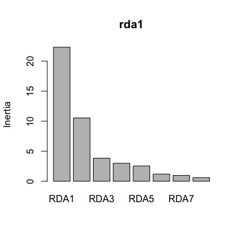
### RDA的可视化
```r
# 创建一个数据框来正确地为区域着色
col_dframe = data.frame("site" = rownames(allele_freqs))
# 一个函数将区域标签添加到数据帧
addregion = function(x){
  # If pop label is present function will output the region
  if(x=="Ale"|x=="The"|x=="Tor"|x=="Sky") y = "Aegean Sea"
  if(x=="Sar"|x=="Laz") y = "Central Mediterranean"
  if(x=="Vig"|x=="Brd"|x=="Cro"|x=="Eye"|x=="Heb"|x=="Iom"|x=="Ios"|x=="Loo"|x=="Lyn"|x=="Ork"|x=="Pad"|x=="Pem"|x=="She"|x=="Sbs"|x=="Sul") y = "Atlantic"
  if(x=="Jer"|x=="Idr"|x=="Cor"|x=="Hoo"|x=="Kil"|x=="Mul"|x=="Ven") y = "Atlantic"
  if(x=="Hel"|x=="Oos"|x=="Tro"|x=="Ber"|x=="Flo"|x=="Sin"|x=="Gul"|x=="Kav"|x=="Lys") y = "Scandinavia"
  return(y)
}
# 增加区域标记
col_dframe$region = sapply(col_dframe$site, addregion)
# 增加因子水平
region_order = c("Scandinavia","Atlantic","Central Mediterranean", "Aegean Sea")
col_dframe$region = factor(col_dframe$region, levels = region_order)
# 创建调色板
# blue=#377EB8, green=#7FC97F, orange=#FDB462, red=#E31A1C
cols = c("#7FC97F","#377EB8","#FDB462","#E31A1C")
```
RDA的可视化
```r
png("rda.png", width = 8, height = 7, units = "in", res = 600)
plot(rda1, type="n", scaling = 3)
title("Seascape redundancy analysis")
# SITES
points(rda1, display="sites", pch=21, scaling=3, cex=1.5, col="black",
       bg=cols[col_dframe$region]) # sites
# text(rda1, display="sites", scaling = 3, col="black", font=2, pos=4)
# PREDICTORS
text(rda1, display="bp", scaling=3, col="red1", cex=1, lwd=2)
# SNPS
# text(rda1, display="species", scaling = 3, col="blue", cex=0.7, pos=4) # SNPs
# LEGEND
legend("bottomleft", legend=levels(col_dframe$region), bty="n", col="black",
       pch=21, cex=1.2, pt.bg=cols)
# OTHER LABELS
adj.R2 = round(RsquareAdj(rda1)$adj.r.squared, 3)
mtext(bquote(italic("R")^"2"~"= "~.(adj.R2)), side = 3, adj = 0.5)
dev.off()
```
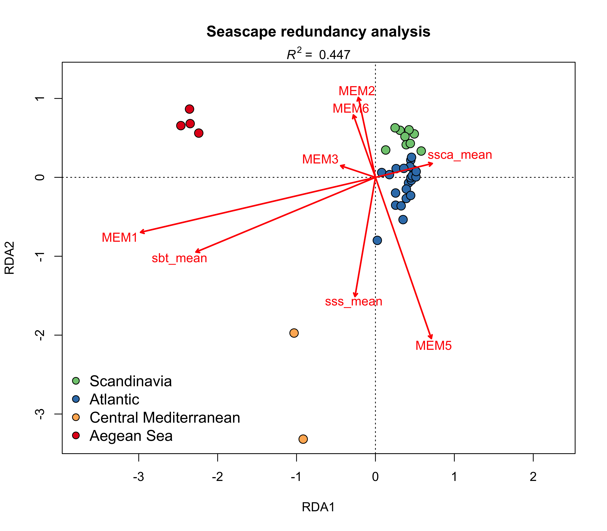
### 部分冗余分析
Partial redundancy analysis
在控制地理位置的同时执行RDA
```r
pRDA = rda(allele_freqs ~ sbt_mean + sss_mean + ssca_mean + Condition(MEM1+MEM2+MEM3+MEM5),
           data = env.dbmems, scale = TRUE)
pRDA
RsquareAdj(pRDA) # adjusted Rsquared 
vif.cca(pRDA) # variance inflation factor (<10 OK)
anova.cca(pRDA, permutations = 1000) # full model
anova.cca(pRDA, permutations = 1000, by = "margin") # per variable
```
可视化
```r
png("partial_rda.png", width = 9, height = 7, units = "in", res = 600)
plot(pRDA, type="n", scaling = 3)
title("Seascape partial redundancy analysis")
# SITES
points(pRDA, display="sites", pch=21, scaling=3, cex=1.5, col="black",
       bg=cols[col_dframe$region]) # sites
text(pRDA, display="sites", scaling = 3, col="black", font=2, pos=4)
# PREDICTORS
text(pRDA, display="bp", scaling=3, col="red1", cex=1, lwd=2)
# SNPS
# text(pRDA, display="species", scaling = 3, col="blue", cex=0.7, pos=4) # SNPs
# LEGEND
legend("topleft", legend=levels(col_dframe$region), bty="n", col="black",
       pch=21, cex=1.2, pt.bg=cols)
# OTHER LABELS
adj.R2 = round(RsquareAdj(pRDA)$adj.r.squared, 3)
mtext(bquote(italic("R")^"2"~"= "~.(adj.R2)), side = 3, adj = 0.5)
dev.off()
```
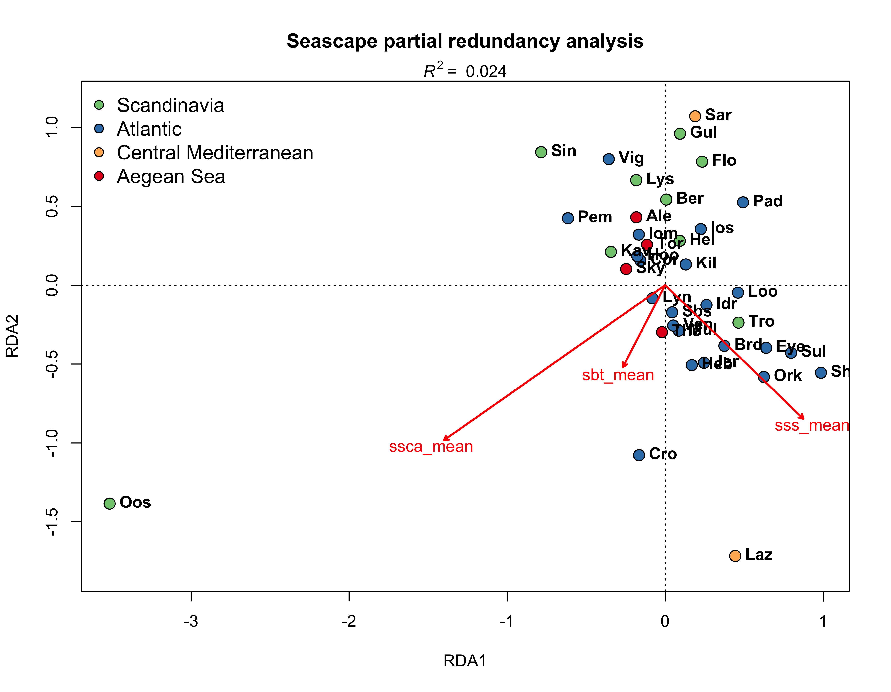
Candidate SNPs for local adaptation？
考察候选核苷酸多态性和当地适宜性的关系
```r
# 在图中，哪个轴比较重要呢？
anova.cca(pRDA, permutations = 1000, by = "axis")
# 提取带显著性的SNP的载荷轴
snp.load = scores(pRDA, choices = 1, display = "species")
# 绘制SNP载荷直方图
hist(snp.load, main = "SNP loadings on RDA1")
```
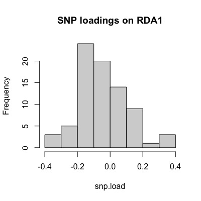
确定分布尾部的SNP
Function from https://popgen.nescent.org/2018-03-27_RDA_GEA.html
```r
outliers = function(x,z){
  lims = mean(x) + c(-1, 1) * z * sd(x) # find loadings +/-z sd from mean loading     
  x[x < lims[1] | x > lims[2]]          # locus names in these tails
}
# x = loadings vector, z = number of standard deviations to use
candidates = outliers(x = snp.load, z = 2.5)
 Convert matric to dataframe
snp.load.df = snp.load %>% as.data.frame
snp.load.df$SNP_ID = rownames(snp.load.df)
str(snp.load.df)

# Extract locus ID
snp.load.df %>% dplyr::filter(RDA1 %in% candidates)
```
## 方差分解
### 简单的方差分解步骤
方差分解可以将每个解释变量（环境因子）独立进行CCA或RDA分析，获得每个解释变量对相应变量的方差变异的解释贡献度，之后通过多组数据取交集的方式获得每个解释变量的独立解释贡献度记忆环境因子共同解释的贡献度。
可以使用内置的数据进行测试
```r
library(vegan)
data("mite")
data("mite.pcnm")
data("mite.env")
# mite是物种群落结构，也就是因变量，第一行是物种名称，之后每行是样本/样地数，差不多意思是就是每个样地的不同物种的数量
head(mite)
#   Brachy PHTH HPAV RARD SSTR Protopl MEGR MPRO TVIE HMIN HMIN2 NPRA TVEL ONOV
# 1     17    5    5    3    2       1    4    2    2    1     4    1   17    4
# 2      2    7   16    0    6       0    4    2    0    0     1    3   21   27
# 3      4    3    1    1    2       0    3    0    0    0     6    3   20   17
# 4     23    7   10    2    2       0    4    0    1    2    10    0   18   47
# 5      5    8   13    9    0      13    0    0    0    3    14    3   32   43
# 6     19    7    5    9    3       2    3    0    0   20    16    2   13   38
# ...

# 这是环境因子，有一些是因子变量
head(mite.env)
#   SubsDens WatrCont Substrate Shrub    Topo
# 1    39.18   350.15   Sphagn1   Few Hummock
# 2    54.99   434.81    Litter   Few Hummock
# 3    46.07   371.72 Interface   Few Hummock
# 4    48.19   360.50   Sphagn1   Few Hummock
# 5    23.55   204.13   Sphagn1   Few Hummock
# 6    57.32   311.55   Sphagn1   Few Hummock

# 另一个环境因子，是pcnm的结果
head(mite.pcnm)
#           V1          V2           V3           V4          V5          V6
# 1 0.01936957 -0.03564740 -0.004243617  0.013606215 -0.05189017 -0.03474468
# 2 0.02327134 -0.04809322 -0.004319021 -0.004129358 -0.06717623 -0.05795898
# 3 0.02553531 -0.05844679 -0.003091072 -0.025699042 -0.07594608 -0.07619106
# 4 0.03065998 -0.07805595 -0.001108683 -0.056124820 -0.08546514 -0.09535844
# 5 0.03105726 -0.08758357  0.003294018 -0.092445741 -0.05775704 -0.08126478
# 6 0.04127819 -0.12060082  0.004167658 -0.126085915 -0.10026023 -0.13218923
# ...

# 可以对数据进行转换，进行hellinger转化
# 但如果因变量只有一列则不需要转换
mod <- varpart(mite,mite.env,mite.pcnm,transfo = "hel")
```
结果如下：
```r
Partition of variance in RDA 

Call: varpart(Y = mite, X = mite.env, mite.pcnm, transfo = "hel")
Species transformation:  hellinger
Explanatory tables:
X1:  mite.env
X2:  mite.pcnm 

No. of explanatory tables: 2 
Total variation (SS): 27.205 
            Variance: 0.39428 
No. of observations: 70 

Partition table:
                     Df R.squared Adj.R.squared Testable
[a+b] = X1           11   0.52650       0.43670     TRUE
[b+c] = X2           22   0.62300       0.44653     TRUE
[a+b+c] = X1+X2      33   0.75893       0.53794     TRUE
Individual fractions                                    
# x1对群落的贡献
[a] = X1|X2          11                 0.09141     TRUE
[b]                   0                 0.34530    FALSE
# x2对群落的贡献
[c] = X2|X1          22                 0.10124     TRUE
# 无法解释的部分
[d] = Residuals                         0.46206    FALSE
---
Use function ‘rda’ to test significance of fractions of interest
```
可视化：
```r
plot(mod, bg = c("hotpink", "skyblue"))
```
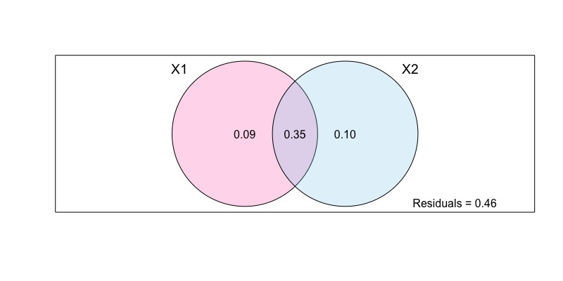
### 全流程方差分解
来自微信公众号：生态R学社
加载数据
```r
# setwd()
# 使载入信息更简洁
# col_types = cols()同理
suppressMessages(library(tidyverse))
species <- read_csv("species.csv", col_types = cols())
env <- read_csv("env.csv", col_types = cols())
# 数据结构和上面那个一样的
glimpse(species)
glimpse(env)
```
变量筛选
```r
suppressMessages(library(vegan))
# 从全模型逐渐消除变量的筛选方式
# 其实也算是一种回归
# 设置全模型与零模型
rda_full <- rda(species~., data = env)
# 从零模型逐渐增加变量
rda_null <- rda(species~1, data = env)
# 双向选择/向左/向右筛选
rda_back <- ordistep(rda_full, direction = 'backward', trace = 0)
rda_frwd <- ordistep(rda_null, formula(rda_full), direction = 'forward', trace = 0)
rda_both <- ordistep(rda_null, formula(rda_full), direction = 'both', trace = 0)
# 查看结果
rda_back
# Call: rda(formula = species ~ SM + AK, data = env)

#                 Inertia Proportion Rank
# Total         9.224e+03  1.000e+00     
# Constrained   8.653e+02  9.381e-02    2
# Unconstrained 8.358e+03  9.062e-01   35
# Inertia is variance 

# Eigenvalues for constrained axes:
#  RDA1  RDA2 
# 851.2  14.1 

# Eigenvalues for unconstrained axes:
#  PC1  PC2  PC3  PC4  PC5  PC6  PC7  PC8 
# 7433  323  153  114  101   57   43   40 
# (Showing 8 of 35 unconstrained eigenvalues)
rda_frwd
# Call: rda(formula = species ~ TK, data = env)

#                 Inertia Proportion Rank
# Total         9223.5835     1.0000     
# Constrained    598.6051     0.0649    1
# Unconstrained 8624.9784     0.9351   35
# Inertia is variance 

# Eigenvalues for constrained axes:
#  RDA1 
# 598.6 

# Eigenvalues for unconstrained axes:
#  PC1  PC2  PC3  PC4  PC5  PC6  PC7  PC8 
# 7744  316  130  101   92   59   44   37 
# (Showing 8 of 35 unconstrained eigenvalues)
rda_both
# Call: rda(formula = species ~ AK, data = env)

#                 Inertia Proportion Rank
# Total         9.224e+03  1.000e+00     
# Constrained   5.511e+02  5.975e-02    1
# Unconstrained 8.673e+03  9.403e-01   35
# Inertia is variance 

# Eigenvalues for constrained axes:
#  RDA1 
# 551.1 

# Eigenvalues for unconstrained axes:
#  PC1  PC2  PC3  PC4  PC5  PC6  PC7  PC8 
# 7667  382  157  117  101   57   49   43 
# (Showing 8 of 35 unconstrained eigenvalues)
```
筛选后使用rda_back的结果，即`species ~ SM + AK`
```r
# 根据模型将变量分为土壤与气候
clim <- env %>% select(SM)
soil <- env %>% select(AK)
```
进行方差分解
```r
vpa <- varpart(species, clim, soil)
vpa
# Partition of variance in RDA 

# Call: varpart(Y = species, X = clim, soil)

# Explanatory tables:
# X1:  clim
# X2:  soil 

# No. of explanatory tables: 2 
# Total variation (SS): 627204 
#             Variance: 9223.6 
# No. of observations: 69 

# Partition table:
#                      Df R.squared Adj.R.squared Testable
# [a+b] = X1            1   0.00171      -0.01318     TRUE
# [b+c] = X2            1   0.05975       0.04571     TRUE
# [a+b+c] = X1+X2       2   0.09381       0.06635     TRUE
# Individual fractions                                    
# [a] = X1|X2           1                 0.02064     TRUE
# [b]                   0                -0.03383    FALSE
# [c] = X2|X1           1                 0.07954     TRUE
# [d] = Residuals                         0.93365    FALSE
# ---
# Use function ‘rda’ to test significance of fractions of interest
```
绘制韦恩图
```r
plot(vpa, bg = 2:5, id.size = 1.1, cex = 1.2, Xnames = c('Climate', 'Soil properties'))
title('VPA')
```
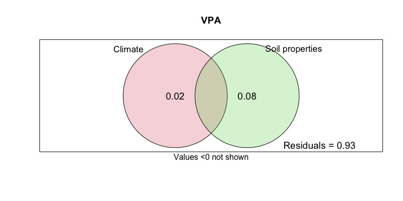
接下来需要检验方差结果的显著性。
```r
anova(rda(species ~ AK + Condition(SM), data = env))
# Permutation test for rda under reduced model
# Permutation: free
# Number of permutations: 999

# Model: rda(formula = species ~ AK + Condition(SM), data = env)
#          Df Variance      F Pr(>F)   
# Model     1    849.5 6.7078   0.01 **
# Residual 66   8358.3                 
# ---
# Signif. codes:  
# 0 ‘***’ 0.001 ‘**’ 0.01 ‘*’ 0.05 ‘.’ 0.1 ‘ ’ 1
anova(rda(species ~ Condition(SM) + AK, data = env))
# Permutation test for rda under reduced model
# Permutation: free
# Number of permutations: 999

# Model: rda(formula = species ~ Condition(SM) + AK, data = env)
#          Df Variance      F Pr(>F)   
# Model     1    849.5 6.7078  0.008 **
# Residual 66   8358.3                 
# ---
# Signif. codes:  
# 0 ‘***’ 0.001 ‘**’ 0.01 ‘*’ 0.05 ‘.’ 0.1 ‘ ’ 1
```
### 多因子方差分解
导入数据
```r
data <- read.csv("nature.csv", head = T, row.names = "NUM_Final")
head(data)
#        COU ELEVATION       LAT    SINLONG    COSLONG  SLO
# 1 Argentina      1214 -41.80778 -0.5323537  0.8465220 1.10
# 2 Argentina      1067 -41.23785 -0.9658973  0.2589256 0.60
# 3 Argentina      1134 -41.10671 -0.9789990 -0.2038651 5.70
# 4 Argentina      1128 -41.00428 -0.9309997 -0.3650200 1.14
# 6 Argentina      1072 -41.03350 -0.9870183  0.1606081 0.60
# 9 Argentina       157 -38.76398 -0.7833883 -0.6215326 0.50
#   ARIDITY     SAND       PH SR CWM_logH   CWV_logH
# 1  0.7848 72.85806 6.816498  7 3.711949 0.27751995
# 2  0.6269 90.25353 6.903776 10 3.869944 0.17866506
# 3  0.4051 79.42284 6.563219 10 3.533342 0.16405435
# 4  0.2688 67.18043 6.451785  9 3.790257 0.07100068
# 6  0.5835 77.67463 6.790220  9 3.900902 0.28703764
# 9  0.7744 83.52515 7.718229  9 4.854603 0.68409263
#     CWS_logH    CWK_logH CWM_logSLA CWV_logSLA  CWS_logSLA
# 1 -0.7637778  1.51160947   4.060573  0.1205683  0.67722158
# 2 -1.2828283  2.96032008   4.291668  0.1575433  0.48483503
# 3 -0.5325850 -0.03714558   4.641273  0.4576920 -0.07818039
# 4 -2.7101555  9.50886526   4.714749  0.1706934 -1.51295106
# 6 -1.3590901  3.13852514   4.129284  0.2935952  0.87061919
# 9 -0.1683289  0.24123964   4.263180  0.1563341  1.37789764
#    CWK_logSLA       BGL       FOS        AMP        NTR
# 1 -0.01011663 0.4377014 1.1229754  0.1014598  0.6105888
# 2 -0.96646930 0.4322344 1.0173889 -0.1683013  1.0122487
# 3 -1.46946238 1.1322424 3.5938745  0.7232067  3.0018218
# 4  0.96103395 1.2320621 3.2734592  0.8042662  3.1684659
# 6  0.76680427 0.9465925 1.5959195 -0.1961237  1.2015001
# 9  2.60828591 0.5010997 0.6338614 -0.3300716 -0.3393366
#   I.NDVI
# 1 3.4635
# 2 4.2668
# 3 7.0073
# 4 6.1115
# 6 4.2859
# 9 7.5435
# 进行对数转换
data[,c(11,12,15,16)] <- log(data[,c(11,12,15,16)])
data[,13] <- log(data[,13]-min(data[,13])+1)
data[,14] <- log(data[,14]-min(data[,14])+1)
data[,17] <- log(data[,17]-min(data[,17])+1)
data[,18] <- log(data[,18]-min(data[,18])+1)
```
环境变量标准化
```r
data$ELEVATION<-(data$ELEVATION-mean(data$ELEVATION))/sd(data$ELEVATION)
data$LAT<-(data$LAT-mean(data$LAT))/sd(data$LAT)
data$SINLONG<-(data$SINLONG-mean(data$SINLONG))/sd(data$SINLONG)
data$COSLONG<-(data$COSLONG-mean(data$COSLONG))/sd(data$COSLONG)
data$SLO<-(data$SLO-mean(data$SLO))/sd(data$SLO)
data$ARIDITY<-(data$ARIDITY-mean(data$ARIDITY))/sd(data$ARIDITY)
data$SAND<-(data$SAND-mean(data$SAND))/sd(data$SAND)
data$PH<-(data$PH-mean(data$PH))/sd(data$PH)
data$SR<-(data$SR-mean(data$SR))/sd(data$SR)
```
瞬时指标标准化
```r
data$CWM_logH<-(data$CWM_logH-mean(data$CWM_logH))/sd(data$CWM_logH)
data$CWV_logH<-(data$CWV_logH-mean(data$CWV_logH))/sd(data$CWV_logH)
data$CWS_logH<-(data$CWS_logH-mean(data$CWS_logH))/sd(data$CWS_logH)
data$CWK_logH<-(data$CWK_logH-mean(data$CWK_logH))/sd(data$CWK_logH)
data$CWM_logSLA<-(data$CWM_logSLA-mean(data$CWM_logSLA))/sd(data$CWM_logSLA)
data$CWV_logSLA<-(data$CWV_logSLA-mean(data$CWV_logSLA))/sd(data$CWV_logSLA)
data$CWS_logSLA<-(data$CWS_logSLA-mean(data$CWS_logSLA))/sd(data$CWS_logSLA)
data$CWK_logSLA<-(data$CWK_logSLA-mean(data$CWK_logSLA))/sd(data$CWK_logSLA)
```
生态功能指标标准化
```r
data$BGL<-(data$BGL-mean(data$BGL))/sd(data$BGL)
data$FOS<-(data$FOS-mean(data$FOS))/sd(data$FOS)
data$AMP<-(data$AMP-mean(data$AMP))/sd(data$AMP)
data$NTR<-(data$NTR-mean(data$NTR))/sd(data$NTR)
data$I.NDVI<-(data$I.NDVI-mean(data$I.NDVI))/sd(data$I.NDVI)
```
文章将这24个变量分别归类为Skew、Mean、Richness、Abiotic、Geo五大类，并进行了标准化和对数转化。
提取其中的生态功能数据：
```r
colnames(data)
M5 <- rowMeans(data[,c(19,20,21,22,23)])
data <- cbind(data, M5)
logM5 <- log(data$M5 - min(data$M5)+1)
data <- cbind(data,logM5)
```
计算R方
```r
library(MuMIn)

# 全模型
# 为什么出现I()函数，原因是x^2表示x和x的相互作用，而I(x)表示单纯的x乘x
mod12<-lm(logM5 ~ LAT + SINLONG + COSLONG +   
            ARIDITY + SLO + SAND + PH + I(PH^2) + ELEVATION+
            CWM_logSLA + I(CWM_logSLA^2)+ CWV_logSLA + I(CWV_logSLA^2) +  CWS_logSLA + CWK_logSLA + I(CWK_logSLA^2) +
            CWM_logH + I(CWM_logH^2)+ CWV_logH + I(CWV_logH^2) +  CWS_logH + CWK_logH + I(CWK_logH^2) +
            SR
          , data=data)
#此全模型的r2即为论文中的r2
library(performance)
r2(mod12)
# R2 for Linear Regression
#      R2: 0.724
# adj. R2: 0.657
# 模型筛选
#通过模型进行指标筛选
dd12 <- dredge(mod12, subset = ~ LAT & SINLONG & COSLONG & ARIDITY & SLO & SAND & PH &SR & ELEVATION &   
               dc(CWM_logSLA,I(CWM_logSLA^2)) & dc(CWV_logSLA,I(CWV_logSLA^2)) & dc(CWK_logSLA,I(CWK_logSLA^2)) 
             & dc(CWM_logH,I(CWM_logH^2)) & dc(CWV_logH,I(CWV_logH^2)) & dc(CWK_logH,I(CWK_logH^2)), options(na.action = "na.fail"))
#提取最优模型集
subset(dd12,delta<2)
#求模型平均后的参数估计值
de12 <- model.avg(dd12, subset = delta < 2)
summary(de12)
# Model-averaged coefficients:  
# (full average) 
#                  Estimate Std. Error Adjusted SE z value
# (Intercept)      0.697322   0.035206    0.035556  19.612
# ARIDITY         -0.136000   0.027174    0.027484   4.948
# COSLONG         -0.040117   0.021512    0.021753   1.844
# CWK_logH        -0.002993   0.029684    0.030021   0.100
# I(CWK_logH^2)   -0.057877   0.019492    0.019688   2.940
# CWK_logSLA      -0.087745   0.029044    0.029335   2.991
# I(CWK_logSLA^2) -0.023259   0.021497    0.021614   1.076
# CWS_logH        -0.132267   0.033251    0.033631   3.933
# CWS_logSLA      -0.022152   0.026052    0.026150   0.847
# CWV_logH         0.043475   0.030028    0.030272   1.436
# I(CWV_logH^2)    0.032969   0.019856    0.020006   1.648
# CWV_logSLA      -0.071439   0.025785    0.026051   2.742
# I(CWV_logSLA^2)  0.070926   0.015442    0.015602   4.546
# ELEVATION        0.016273   0.020789    0.021019   0.774
# LAT              0.003561   0.027182    0.027464   0.130
# PH              -0.086922   0.029385    0.029723   2.924
# I(PH^2)         -0.056956   0.019178    0.019395   2.937
# SAND            -0.106034   0.018628    0.018844   5.627
# SINLONG         -0.011265   0.018722    0.018938   0.595
# SLO             -0.001518   0.023037    0.023300   0.065
# SR               0.056643   0.023038    0.023275   2.434
# CWM_logSLA       0.015673   0.025068    0.025143   0.623
#                 Pr(>|z|)    
# (Intercept)      < 2e-16 ***
# ARIDITY         7.00e-07 ***
# COSLONG          0.06516 .  
# CWK_logH         0.92057    
# I(CWK_logH^2)    0.00328 ** 
# CWK_logSLA       0.00278 ** 
# I(CWK_logSLA^2)  0.28188    
# CWS_logH        8.39e-05 ***
# CWS_logSLA       0.39694    
# CWV_logH         0.15096    
# I(CWV_logH^2)    0.09937 .  
# CWV_logSLA       0.00610 ** 
# I(CWV_logSLA^2) 5.50e-06 ***
# ELEVATION        0.43883    
# LAT              0.89684    
# PH               0.00345 ** 
# I(PH^2)          0.00332 ** 
# SAND             < 2e-16 ***
# SINLONG          0.55196    
# SLO              0.94804    
# SR               0.01495 *  
# CWM_logSLA       0.53307    
#求各类型参数贡献的百分比
d1<-summary(de12)
d2<-d1$coefficients
d3<-d2[1,]
d4<-d3[c(2:22)]
d5<-abs(d4)
# 这就是模型总斜率
sum(d5)
[1] 1.076063
```
查看Geo地理参数对总斜率的贡献：
```r
# ELEVATION + LAT + SINLONG + COSLONG
(0.016272654+0.003560670+0.011264754+0.040117124)/sum(d5)
# [1] 0.06618123
```
意思是Geo参数在模型解释的R2中的占比为3.9%。
以此类推。
绘制森林图
```r
d2<-as.data.frame(d1$coefmat.full)
d3<-tibble::rownames_to_column(d2)
d3$factor<-d3$rowname
View(d3)
d3<-d3[c(2:22),]
library(ggplot2)
d3$factor<-factor(d3$factor, levels=c("COSLONG", "SINLONG",
                     "LAT","ELEVATION", "ARIDITY", "SAND", "I(PH^2)", "PH",
                     "SLO" , "SR", "CWV_logSLA" , "CWM_logSLA","I(CWV_logH^2)",  "CWV_logH",
                     "I(CWV_logSLA^2)","CWS_logH","CWK_logSLA", "I(CWK_logH^2)","I(CWK_logSLA^2)", 
                     "CWS_logSLA", "CWK_logH"))

f1 <- ggplot(d3, aes(x=factor, y=Estimate)) + # , fill=Response_ord
  geom_point(size=1.5,stroke = 1.5)+
  geom_errorbar(aes(ymin=Estimate-1.96*`Std. Error`, ymax=Estimate+1.96*`Std. Error`), width=0)+
  coord_flip() +
  ylab('Parameter estimates') +
  xlab("") +
  theme(axis.text=element_text(size=12,face="bold"),
        axis.title=element_text(size=12,face="bold"))+
  geom_hline(yintercept=0, lty=2, size=1, color="red")
plot(f1)
```
**注意：**
**回归的Estimate就是B值就是beta就是回归的斜率**
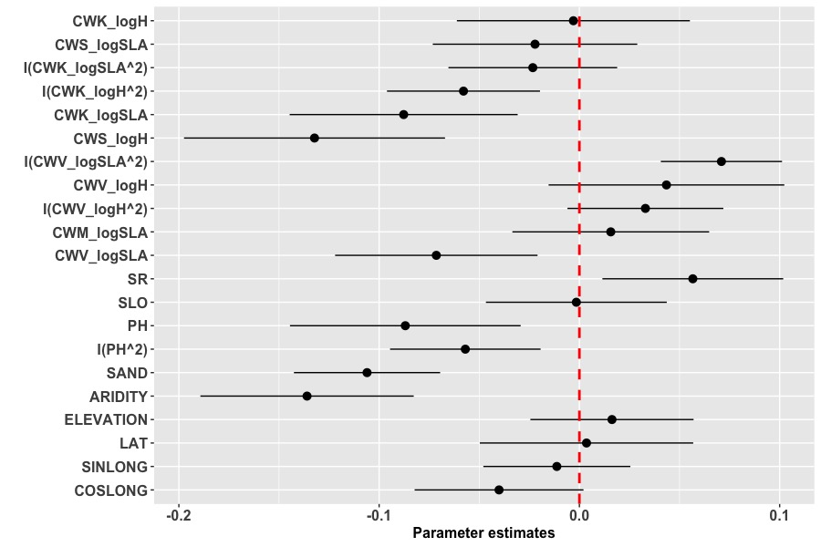